::: callout
## This is a computational notebook

Quarto enables you to weave together content and executable code into a finished document. To learn more about Quarto see <https://quarto.org>.

## Running Code

When you click the **Render** button a document will be generated that includes both content and the output of embedded code. You can embed code like this:

```{r}
1 + 1
```

You can add options to executable code like this

```{r}
#| echo: false
2 * 2
```

The `echo: false` option disables the printing of code (only output is displayed).

You can delete this entire callout between and including the lines

```         
::: callout
```

and

```         
:::
```

and start the report from the Introduction section below.
:::

## 

#### Role Distribution

-   **Project Coordinator**\
    *organizes meetings and deadlines*

    -   Vincent\
    -   Jasper\
    -   Youjin\
    -   Shreya\
    -   Vasileios

-   **Research Lead**\
    *oversees background research*

    -   Jasper <br>

-   **Mapping Specialist**\
    *creates maps and spatial visuals*

    -   Vincent\
    -   Vasileios <br>

-   **Data Analyst**\
    *analyzes collected data*

    -   Youjin\
    -   Vasileios <br>

-   **Writer/Editor**\
    *drafts and edits project texts*

    -   Shreya\
    -   Jasper <br>

-   **Presentation Lead**\
    *prepares group presentations*

    -   Vincent <br>

-   **Design Lead**\
    *works on visual layouts and graphics*

    -   Youjin\
    -   Shreya

## Introduction

##### **The case of Senica**

Through the heart of the city of Slovak Senica, near the Czech border, flows the Teplica. Due to economic pressures the stream has been heavily altered and has been rendered invisible and insignificant in the urban landscape. Currently, the Teplica is struggling with several problems, namely poor flood handling, poor morphological and ecological quality, low flow during dry periods, an upstream dam, and poorly utilized public space (Škrinár, 2025). The city of Senica is taking steps towards the restoration of this stream serving as an exemplary project within the 'ReBioClim-project'. This EU project aims to restore urban streams while focusing on both biodiversity, climate change, and liveability in cities (City of Senica, 2024a).\
\
While the Slovak water management company (SVP) focuses mainly on protecting the area against flooding caused by heavy rainfall, more functional access to the water, and improved water flow (City of Senica, 2024b), other goals of the project include improving hydromorphology, ecology and diversity in urban areas, and utilizing the stream for recreational purposes. On the other hand, qualitative and experiential aspects such as human-nature connectedness are given little attention. In order to bridge this gap and ensure a lasting impact of the urban stream restoration, the enquiry in this report is focused on a method to determine the potential for human-nature connectedness along the Teplica stream.\

-   **Research Question :** What parts of the Teplica stream have the most potential for human-nature connectedness and to create a biophilic environment?

##### **Human-nature connectedness and its relevance to urban stream restoration**

Human-nature connectedness challenges the idea of human superiority over nature,while strengthening the outlook that humankind is a part of nature. Research has shown that this sense of connectedness cannot be created through education only (Spiller, 2024). Spatial composition plays an important role in this process where people must come into direct contact to build a strong relationship with their natural environments.

A theory that has gained recognition in recent decades and is often associated with human-nature connectedness is the biophilia hypothesis (Bhaskar, 2023; Lefosse et al., 2023). This hypothesis states that humans have an innate tendency to seek connections to nature (Grinde & Patil, 2009; Wilson, 1984). This connection is supported with evidence from multiple different fields of study (Grinde & Patil, 2009). The results from several of these studies show a strong connection between human-nature connectedness and an increased human health and wellbeing. This connection is not just physical, but also cognitive, emotional and biophysical (Ives et al., 2017).

Biophilic design, based on the biophilia hypothesis focuses on reinforcing the relationship between humans and the natural world through the creation or strengthening of biophilic places (Da Silva et al., 2021). Human-nature connectedness forms the starting point of this approach. It proposes to utilize green infrastructure to improve ecosystem health and human wellbeing. These places have shown great potential in different ways. They increase social interaction, as people view them as places of improved livability and sociability (Lefosse et al., 2023). Biophilic places also strengthen social cohesion, as they positively influence the perceived social cohesion, as well as facilitating more (semi-)social activities that strengthen community bonds. Another important effect of biophilic places, and the subsequent increase in regular experiences of nature, is that they raise environmental awareness and encourage a more sustainable way of living. Furthermore, on the long term biophilia can aid ecosystem conservation efforts (Bhaskar, 2023). People who are connected to nature and have a strong relationship to nature are more likely to participate in more sustainable behavior and to support ecosystem and biodiversity conservation efforts.

By determining how biophilic a place is, we can derive how much it improves the human-nature connectedness of the people living around it or visiting it. A biophilic place has a great impact on the people living around it, while a place that is not biophilic lacks this character. By determining the amount of biophilic integration, we can show which places have the largest need for improvement and which places are already performing well.

##### **How does biodiversity affect human-nature connectedness?**

While biophilic integration mainly focusses on connecting people to nature, the importance of biodiversity cannot be overlooked (Lefosse et al., 2023). Streams are complex ecosystems and all the different present species contribute to the complex system that is this ecosystem (Bhaskar, 2023). Biodiversity therefore is of vital importance in protecting this ecosystem from collapse. In assessing the need for change in the areas around streams, it is therefore important to also look at indicators for biodiversity and ecosystem functionality.

By analysing biodiversity, we can determine where the creation or dedication of ecological networks is most necessary. So that they can provide more ecosystem services (Lefosse et al., 2023; Ranta et al., 2021a). Biophilic integration has shown great potential in reinforcing urban biomes that can act as biodiversity incubators through an increase in natural repopulation of plant and animal species (Bhaskar, 2023; Panlasigui et al., 2021).

##### **How does microclimate affect human-nature connectedness?**

Another way in which biodiversity and biophilic integration are linked is through microclimate ecosystem services (Lefosse et al., 2023). The amount of biophilic integration relies on the ecosystem services a local ecosystem can provide. Reinforcing ecological networks, increases ecosystem functionality and therefore the amount of biophilic integration. By having more diverse natural elements, both green and blue, containing multiple different species, the environmental impact of a place is enhanced. Different species have different cooling, air-, soil- and water purification, and wind regulating properties. With these species working together, and sometimes even positively affecting the properties of other species, their impact can grow even further. The more biodiverse a place is, the more biophilic it can be, and the more it can improve human-nature connectedness. By analyzing the performance of the existing microclimate we can again determine where action is needed most.

## Methods

### MCDA

#### Criteria

For the MCDA, the analyses are split into three main categories: quality of life, biodiversity and climate change. For each category a couple of analyses are done that give an indication of the human-nature connectedness around the stream. Based on that we can give an indication of where change is needed the most to improve this relationship. The following table shows details for each criteria along with the buffer and weights used, these are things that are better explained later for each individual criteria.

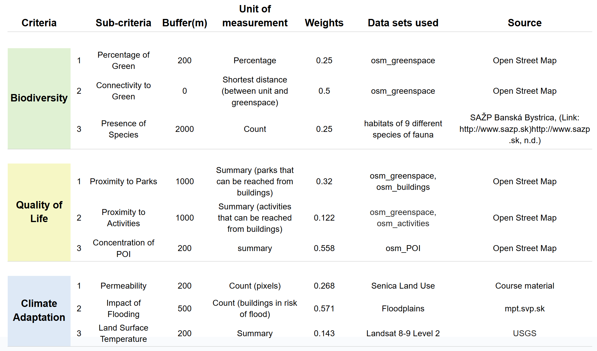

#### Units

To evaluate these criteria for the Teplica stream, a spatial unit needed to be chosen. The first option was to tile the plane around the stream using either squares or hexagons, and use every tile through which the stream flows to aggregate data. However, the Teplica stream is quite small and using such units requires a very coarse scale to meaningfully aggregate data, due to which the desired spatial detail could not be achieved. The second option was to use points on the stream and buffer in a set radius around them. However, this method averaged most criteria too much to the point it was hard to get a meaningful distinction between the points. In the end, a compromise was selected; the stream was divided into 200m intervals and areas were then buffered out perpendicular to the stream, without overlapping. To achieve a good result the stream was first simplified, due to which some parts might not fully align with the stream, but the overall quality of the zones was improved.

The 200m interval was chosen because it divided the stream into appropriate size for the conduction of this type of analysis, taking into consideration the overall size of the river. Of course depending on the situation different intervals could be chosen and the results will also differ.

An important factor to consider was that every criteria might have a different spatial influence. Some criteria work on a very local scale, like temperature, which is only relevant in a small area around a stream or a green space, while others like presence of species require a larger area to be relevant. To account for this, different buffer distances were chosen for every criterion. How exactly these were determined is further explained in the section of the relevant criterion.

##### Biodiversity

The first category of evaluation is Biodiversity. To determine the amount of biodiversity of the area around the stream we are focusing on three aspects. The first two of those are related to the theory of island biogeography (MacArthur & Wilson, 2001). It states that the larger a green area is, the more biodiverse it will be (Conor & McCoy, 2013). This green area size is determined by two factors: the size of a single continuous green area and the interconnectedness between green areas. To determine the potential biodiversity around the stream, we are analyzing the percentage of green space around the stream, giving us an indication of the size of the green area. For interconnectedness, the study analyzes the connectivity between green areas and streams, therby extending the concept of interconnectedness between green areas to cover interactions between land and water ecosystems. After analyzing this, we are also looking into the presence of different species in the area around the stream, as this gives us a more reliable indication of the actual biodiversity that is currently present.

###### **Biodiversity 1** \| Percentage of green

In this analysis, the ratio of green space to total area serves as a proxy for assessing the amount of natural habitat near the Teplica stream. Using percentage as an indicator allows for standardized comparison across spatial units with differing sizes and characteristics.

To calculate this ratio, the buffer distance is a crucial factor. A buffer of 500 meters was applied, as this range effectively includes most of the surrounding green spaces. Green areas were intersected with the spatial units with 500m buffer, creating new layer that represents the amount of green space within each unit. This intersected green area values were then joined to the buffer layer, enabling the calculation of the percentage of green for each unit. The formula below used for final value.

> Percentage of green = (intersected green area) / (500m buffered unit area) \* 100

Since the green space percentages approximately range from 0% to 30%, the values were normalised by dividing by 30, using the following formula.

> Normalised value = (Percentage of green)/30

However, this approach may not fully reflect the habitability for different species. The total size of contiguous green spaces might be more significant than the mere percentage within a buffer. A potential improvement would be to assign ecological value or rank to each green space patch and create a new indicator that reflects both the quality and amount of green space intersecting each unit.

###### **Biodiversity 2** \| Connectivity to green

This section evaluates the interconnectivity between natural environments. As each unit corresponds to a section of the stream, the distance to the nearest green space from each stream unit is adopted as an indicator, reflecting how closely water ecosystems are linked to the land habitats.

Accordingly, this distance-based indicator supplements area-based criterion by capturing the spatial accessibility of natural areas from the stream. Even if a considerable amount of green space exists, it may have limited ecological value if it is located too far from the stream. This is especially critical for small animals such as frogs, which depend on direct connections between water and land habitats.

For this criterion, no buffer is needed, as the stream line itself serves as the base for calculating distance. Using the processing tool “Shortest Line Between Features”, the shortest distance from each stream unit to the nearest green space was calculated, based on the "osm_greenspace" and "units" layers.

However, when normalising, larger distance indicates weaker connectivity between stream unit and green space nearby. Therefore, the values are inverted to ensure that higher normalized scores reflect stronger connectivity. As a result, the following formula was applied:

> Normalised value = 1 - (value - minimum) / (maximum - minimum)

Since the minimum distance was 0, the formula simplifies to:

> Normalised value = 1 - (value / maximum)

This method produces a normalized score between 0 and 1, where a value of 1 represents the shortest distance (i.e., highest potential connectivity), and values closer to 0 indicate increasing distance from green spaces. This approach directly reflects the inverse relationship between distance and ecological connectivity, where farther distances correspond to lower connectivity potential. Compared to the previous quantile-based method, this continuous normalization may better capture the steep decline in connectivity that occurs with increasing distance from green spaces.

###### **Biodiversity 3** \| Presence of species

It is worth noting that the presence of ecological corridors near or within urban areas, is one of the important things in biophilic cities. Species present in the area are a direct indicator of the presence of varied habitats and ecological areas in the city. The findings from these could then be used to find areas lacking biodiversity in order to improve diversity in them.

A buffer of 2km is applied to this criterion considering the movement of fauna, which includes mammals and reptiles. This buffer area also includes parts of forest surrounding the east of Senica. Data on a total of 9 distinct faunal species (sourced from the Slovak atlas) was merged to form a layer containing count of each of the species. This was intersected with the spatial buffer to count the number of distinct species in each buffer unit, 9 indicates the highest diversity whereas 5 is the lowest count for diversity of species per unit. The values were also aggregated to the stream segments to see how this is translated to the spatial unit.

> Normalise value = (value – min value)/ (max value - min value)

The range of species count is classified into ten quantile-based groups to maintain homogenity while comparing with other criteria. A score of 0 – 1.0 is assigned to each group ranging from lowest biodiversity count to the highest.

##### Quality of Life

The second category of evaluation is Quality of Life where different criteria have been created and evaluated to assess the current situation in Senica and also understand if and where there is potential for future changes. The criteria used to evaluate the situation are Proximity to Green Spaces , Proximity to Activities and Concentration of Points of Interest.

These criteria in order are used to describe how well connected are the people with the green spaces, what is the daily movement of the people and if there is something that attracts the people to the stream of Teplica.

###### **Quality of Life 1** \| Proximity to Parks

This criteria describes the distribution of green spaces in the area and their proximity to surrounding buildings. The analysis was conducted using the Attraction Reach function in QGIS, which calculates how many parks are accessible from each building within a walking distance of 500 meters. This threshold is commonly used to represent a comfortable walking distance in urban planning. To enhance the accuracy of the analysis, greater weight was assigned to larger green spaces, based on their total area. This weighting approach is supported by the concept of biophilia, which emphasizes the human need for connection with nature. Research shows that larger green spaces tend to be more biodiverse, thereby offering stronger biophilic benefits (Conor & McCoy, 2013). This justifies prioritizing them in the accessibility calculation.

The unit buffer used is 1000m in order to include most of the city of Senica in order to provide a broader view of green space attraction beyond immediate riverfront areas. The outcome from this analysis was later normalised to be comparable with the other criteria. The method used for normalising is:

> Normalise value = (value – min value)/ (max value - min value)

This data is further aggregated onto river segments by intersecting the buffer units with the Teplica segments in order to have all the data in the same unit of analysis.

###### **Quality of Life 2** \| Proximity to Activities

The second criterion examines the presence of activities within the urban area to better understand how people interact with and move through the city. Various types of activities, such as churches, commercial spaces, and offices, were taken into account. An Attraction Reach algorithm, similar to the one used for assessing proximity to parks, was applied to calculate how many activity locations are accessible within a 500-meter walking distance from each building. This method provides valuable insights into potential movement patterns and highlights areas that may attract higher foot traffic. When combined with data on green spaces and parks, it contributes to a more comprehensive understanding of urban liveliness and accessibility.

The unit buffer used in this case was also 1000m around the stream to provide a citywide perspective on activity distribution, rather than limiting the analysis to areas immediately adjacent to the stream.The result of the Attraction reach algorithm where joined by location summary with the 1000m buffer and later normalised using the same method as before.

> Normalise value = (value – min value)/ (max value - min value)

Additionally, the data was aggregated into stream segments, again so that everything is on the same unit of analysis to be comparable with each other which is also the point of the MCDA method.

###### **Quality of Life 3** \| Concentration of P.O.I.

The third and final criterion used in this analysis is the concentration of Points of Interest (POIs) along the Teplica stream. These POIs encompass a wide variety of features, including recreational activities, shops, monuments, benches, public artworks, and other amenities that contribute to the vibrancy of public space. To evaluate their impact, only POIs located within a 200-meter buffer along the stream were considered. Additionally, POIs were graded based on their proximity to the stream, with those closer to the watercourse given a higher value. This approach reflects their potential to draw people toward the stream, thereby fostering greater interaction between the urban population and the surrounding natural environment.

To perform this analysis a series of points was generated along the geometry of the stream, spaced at 10-meter intervals in order to use the Attraction Reach algorithm from POI to points along the stream. This resolution is appropriate given the scale of both the stream and the urban context. The Attraction Reach function was then applied to the POI and that was joined by location summary into the 200m buffer units. In order to be on the same threshold the units were normalised with the same method as before.

> Normalise value = (value – min value)/ (max value - min value)

While also aggregated into the stream segments by interesting the buffer with the Teplica stream.

The outcome highlights a notable concentration of POIs in the city center, suggesting that this area is already a focal point of activity. This also provides insight into potential zones for enhancing green infrastructure, where increasing greenery could further promote interaction with the stream and strengthen the human-nature relationship in urban settings.

##### Climate Adaptation

TThe third category of evaluation is Climate adaptation. This set of criteria is used to understand how well the area can adapt to extreme changes in the weather conditions. This is also important to ensure that the green spaces will preserve their qualities and be available in order to maintain the connectivity with the people and to promote biophilia.

For climate adaptation 3 criteria were used in order to get a better understanding of the area. These criteria are Permeability of the ground, Flood Risk and Land Surface Temperature.

###### **Climate Adaptation 1** \| Permeability

This criterion evaluates the ground’s ability to collect and absorb rainwater. To estimate this, it was assumed that all non-paved areas represent permeable surfaces capable of water infiltration. A land cover image of the city of Senica was used to identify paved areas, which were then isolated using the Raster Calculator tool in QGIS. To focus the analysis on areas relevant to water absorption near the stream, a 200-meter buffer zone was created around the stream network. The land cover image was then clipped to this buffer zone, narrowing the scope to a meaningful spatial scale. Using the Zonal Statistics tool, the proportion of permeable versus impermeable surfaces was calculated for different zones along the stream by counting the pixels of the image that indicate the paved areas. Afterwards these were joined by location summary with the 200m buffer and later normalised with a similar method as before.

> Normalise value = (value – min value)/ (max value - min value)

The normalised values showed the permeability of the ground however this scale indicated that high values are less permeable. So the values were inverted so that higher values indicate more permeability. The inversion was done using this method.

> 1 - "Normalised value"

Finally, the results were aggregated to the corresponding river segments for further analysis. .

###### **Climate Adaptation 2** \| Impact of Flooding

To assess the impact of flooding, the amount of buildings affected by a q100 was estimated. First the flood risk map was retrieved from the mpt.svp.sk gis server. Multiple types of flood risk maps were available, namely the q10, q100 and q1000 maps. These respectively indicate the likeliness of such a flood, for example the q100 indicates a flood that would on average occur every 100 years. The q100 was chosen, since it is still a relatively common occurrence, and the impact is significant enough to take measures against. The flood basin reaches at most 500 meters away from the banks of the Teplica, therefore the buffer was chosen as such.

Another important point to consider is that there are multiple ways to determine the impact of a flood. For example, the total land area affected, the amount of built-up land affected or the amount of buildings affected. Due to the urban structure of Senica, of which a large part consists of industrial buildings with large footprints, the total number of buildings was chosen as a measure since it more closely measures the amount of people affected by a flood. A population density map would have been preferable, however, none was found at a sufficiently high resolution.

So the total number of buildings was counted per unit buffer, the values were normalised as usual and the data was aggregated into the river corresponding segments by intersecting the buffer used with the stream.

###### **Climate Adaptation 3** \| Land Surface Temperature

For the final criterion the Land Surface Temperature was calculated. The data was retrieved from the USGS Landsat 8-9 Level 2 satellite data. Particularly, the B10 band measures thermal infrared and is therefore representative of land surface temperature. The data is a snapshot of a sunny day in May 2025.

The buffer was chosen according to a study by Wu, Zhijie & Zhang, Yixin. (2019) which found green spaces within 200m had a significant effect on urban land surface temperature.

So the average temperature was calculated in the unit buffer of 200m around the stream and the same process with the rest of the analysis was conducted. First the values were normalised and then aggregated to find the average temperature on each stream segment.

> Normalise value = (value – min value)/ (max value - min value)

#### Criteria Weighting

Weighting of the criteria used in MCDA is carried out using the saaty matrix (Fuzzy AHP, n.d.). This is done separately for each criterion where the three sub-criteria within each criterion are weighed against each other based on its relevance to the overall objective of creation of a biophilic environment. It is also important to note that the weighting takes into account reliability of the data source for each sub criteria. Eigenvector(non-fuzzy) calculation method is used for all the weighting. 

::: {layout-ncol="3"}
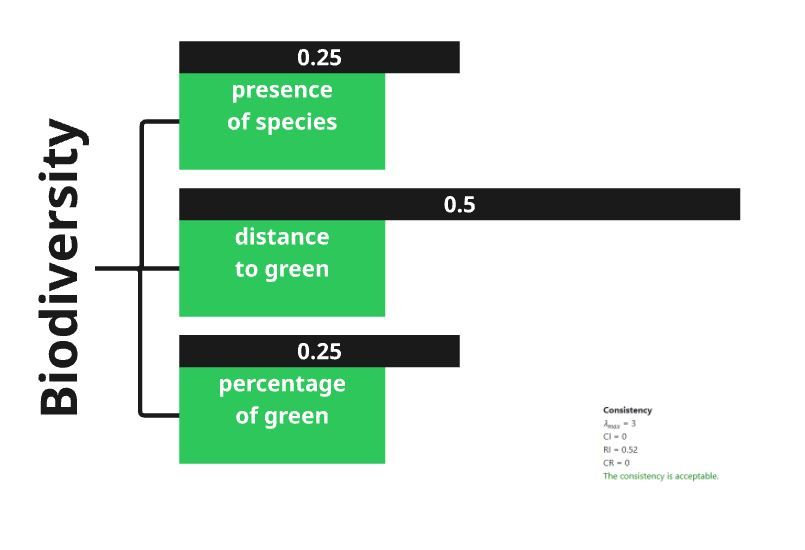{width="312"}

{width="312"}

{width="312"}
:::

For the 1st criteria of Biodiversity, distance of green spaces from the stream is rated the highest as it has a direct impact on the stream health, and potential access of human and non-human species.

In Quality of Life, the proximity of points of interest such as cafes, park benches, etc from the stream is rated the highest since it has the highest potential of attracting people which ensures human-nature connectedness.

For Climate Adaptation, anticipated flood affected areas carry the highest weight as this directly affects the surrounding built environment. Higher risk of flood would mean people moving away from the stream which counters the objective of improved human nature connectedness with the stream.

The three main criteria - Biodiversity, Quality of Life and climate adaptation are considered equally important to arrive at a concluding map.

### Typology construction

#### Objective and approach

While the MCDA offers a structured evaluation of the Teplica stream through distinct criteria related to biodiversity, quality of life, and climate change, it has limitations in capturing how these criteria interact within each spatial unit. MCDA focuses on individual indicator performance and their weighted aggregation, but it does not reveal the relationships among indicators or the typical combinations of conditions observed along different segments of the stream.

To move from evaluation toward actionable strategies for urban stream restoration, it is necessary to understand not just where the stream performs poorly or well on individual criteria, but what kinds of local conditions are present and recurring across the stream. As a result, typology construction is needed to identify meaningful patterns of combined indicator values that characterize the current state of the stream.

In the case of the Teplica stream, we work with 54 spatial units. Ideally, each unit would be assessed individually and provided with a tailored design intervention. However, this level of resolution is often impractical in real world applications. Instead, recurring patterns of indicator combinations can be detected, grouping similar units into types and propose strategic directions for each type. To achieve this, k-means clustering will be applied, a method that forms cluster of spatial units based on the similarity of selected indicator values.

This approach not only simplifies the complexity of stream conditions but also facilitates a typology-driven restoration planning process, where each cluster can inform a targeted and context-sensitive intervention strategy.

#### Script-Based Implementation

The entire typology construction process was implemented in R. To support reproducibility of research, key parts of the R script are embedded throughout this section.

Readers can follow each steps of the analysis by referring to the embedded code blocks.

#### Typology Setup

**packages for clustering**\
Two R packages were required for this process: sf for handling spatial data and stats for performing k-means clustering.

* `sf` : processing vector data
* `dplyr` : selecting and transforming data.

The following R code initializes the loading of package
```{r}
library(sf) # for processing vector data 
library(dplyr) # for selecting and transforming data
```

If the code not works, that means the packages are not installed yet. In that case, use this code (remove # when use):
```{r}
#install.packages("sf") 
#install.packages("dplyr")
```


**spatial unit**\
To perform the typology analysis, same spatial unit used in the MCDA is adopted: 54 segments along the Teplica stream dvided equally into 200m length. This consistent unit length ensures comparability between both analyses and allows the typology to directly build upon the evaluation framework established earlier.

The following R script initializes the loading of spatial unit: 
```{r}
units <- st_read("MCDA.gpkg", quiet = TRUE)
```

Data file (`MCDA.gpkg`) should be located in the root of your working directory folder. If you are not sure where the directory folder is, use following script:
```{r}
getwd()
```


**variables**\
Three variables were selected from the MCDA criteria to serve as inputs for the clustering process;

-   Connectivity to green (weighted 0.5 for biodiversity)

-   Concentration of POI (weighted 0.558 for Quality of Life)

-   Impact of flooding (weighted 0.571 for Climate Adaptation)

For each of the three main categories;biodiversity, quality of life, and climate change, the criterion with the highest weight was chosen, as it best represents the most influential factor in determining the biophilic value of each stream unit.

These variables are stored in the file `MCDA.gpkg`, with the following field names:

* `Connectivity`: field representing connectivity to green. A normalized value based on the distance to the nearest green space.Since the values are inverted, higher values indicate closer proximity and stronger potential for connectivity.

* `POI`: field representing concentration of POI. A normalized value based on concentration of Points of Interest (POI) within a 200m buffer. Higher values indicate higher concentration of POI

* `FloodRisk`: field representing Impact of flooding. A normalized based on number of buildings intersect with flood area. Since the values are inverted, higher values indicate less anticipated impact from flood.

The following R script creates feature only contains relevant variables:
```{r}
features <- units |> #set name of new feature
  select(Connectivity, POI, FloodRisk) |> #select relevant columns only
  st_drop_geometry() # remove geometry column so we just keep a data table
```

**Standardization**

The numbers of each variables should be standardized to be used in k-means clustering.

The following R script creates data with standardized value:
```{r}
#Standardize (mean=0, sd=1) 
X_scaled <- scale(features) # set name for standardized features
```

#### Clustering

**Determine optimal k**
'k' in k-means clustering refers to number of clusters. Inertia is used as the indicator for finding optimal k, which means total distance between points from cluster centers. However, this does not mean that k with lowest inertia will be selected, as inertia constantly decreases while k increases. Instead, elbow method will be used. In elbow method, optimal k is where inclination dramatically changes in the graph showing relationship between k and inertia. 

The following R script calculates inertia for each k, from 2 to 9:
```{r}
# Initialize an empty numeric vector to store inertia values 
inertia <- numeric() #set the name for inertia value pocket

# Try k values from 2 to 9
k_values <- 2:9 #set the name for k value 

# Loop through each k value
# tot.withinss is Total within-cluster sum of squares
# This measures how compact the clusters are: lower is better.

for (k in k_values) {
  km <- kmeans(X_scaled, centers = k, nstart = 20) #set the name for kmeans value pocket
  inertia <- c(inertia, km$tot.withinss)
}
```

The following R script makes plot for elbow method:
```{r}
# Combine the results into a data frame for plotting
elbow_df <- data.frame(k = k_values, inertia = inertia) #set the name of data frame

# Make the elbow plot
plot(k_values, inertia,
     type = "b",                  
     col = "darkblue",
     main = "Elbow Method")
```
Based on elbow plot, the optimal number for clustering is 4, as the inclination changes dramatically at 4.

**k-means clustering** 

For clustering, k-means algorithm is used. When Combined with spatial unit data, each spatial unit will be assigned a cluster number based on the results of the k-means clustering.

The following R script runs k-means clustering:
```{r}
# sets the random number generator to a fixed state, to show same result when re-run the code
set.seed(0)  # set the number for fixed state

# Choose the number of clusters based on the elbow plot
k <- 4 

# Run K-means clustering on the standardized data
kmeans_result <- kmeans(X_scaled, centers = k, nstart = 20) #set name for k-means result data
```

The following R script shows distribution of clusters:
```{r}
# Add the cluster labels to the spatial data
units$cluster <- as.factor(kmeans_result$cluster) 

# Show how many units fall into each cluster
print(table(units$cluster))

# Plot clusters with base R
plot(units["cluster"], 
     main = "Spatial Pattern of Urban Stream Clusters",
     border = NA)
```
The following R script saves clustering into seperate geopackage file (remove # when use): 
```{r}
#st_write(units, "unit_cluster.gpkg")
```

#### Cluster Centers

To interpret character of each cluster, center value for each variables should be extracted. Then center values are compared to see difference between each clusters. The research focused on variable with low values for each clusters to figure out appropriate interventions needed for each clusters. 

The following R script extracts cluster centers for each clusters:
```{r}
# Get the cluster centers (in standardized form)
scaled_centers <- kmeans_result$centers #set name for cluster center value pocket

# Convert the centers back to original scale: x * SD + mean
original_centers <- t(apply(
  scaled_centers, 1, 
  function(x) x * attr(X_scaled, "scaled:scale") + attr(X_scaled, "scaled:center")
))

# Print the original values
print("Cluster centers (original):")
print(original_centers)

```
## Results

### MCDA

#### Analysis for each category

**Biodiversity**

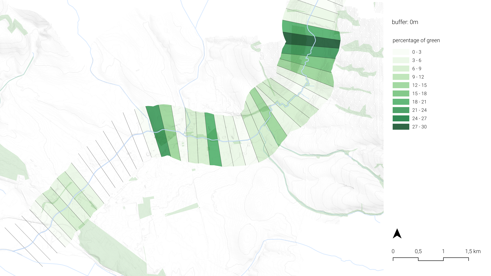

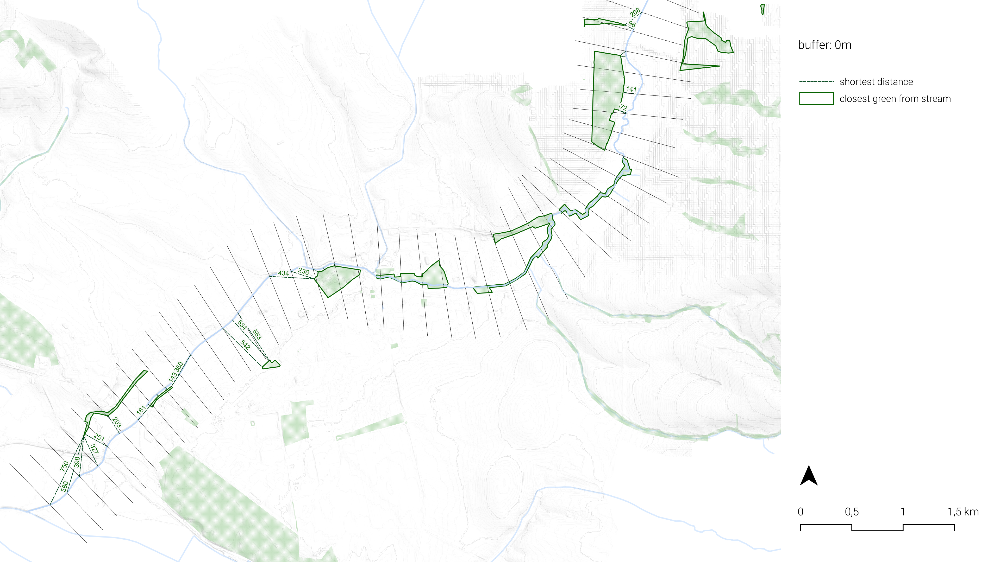

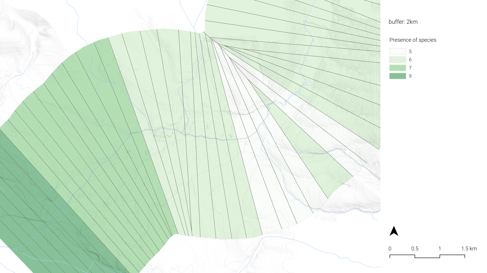

**Quality of Life**

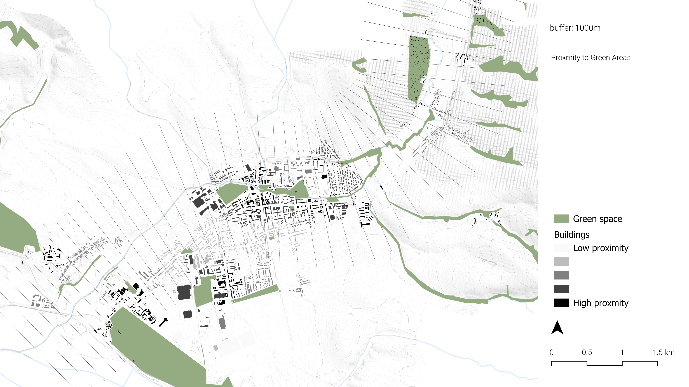


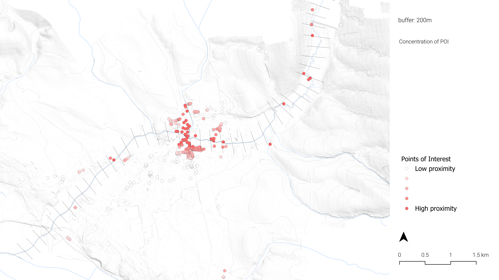

**Climate Adaptation**

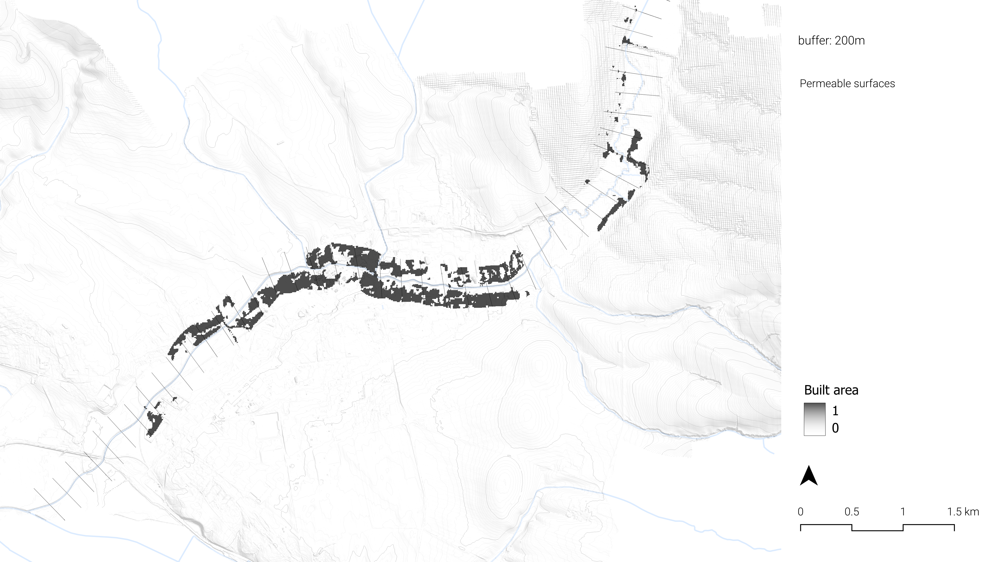


#### Normalized Result

**Biodiversity**

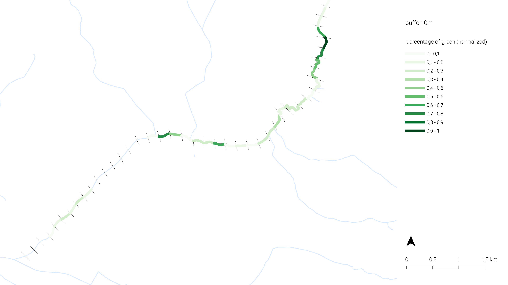{width="312"}

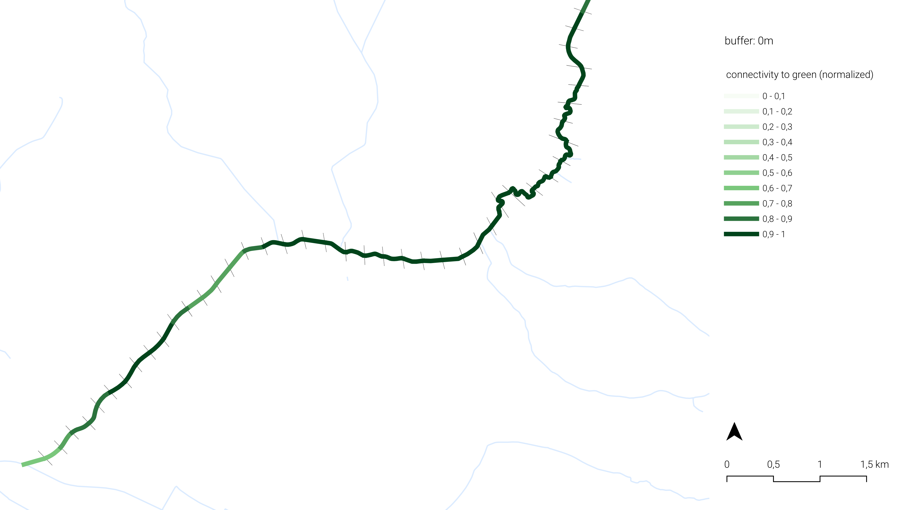{width="312"}

{width="312"}

**Quality of Life**

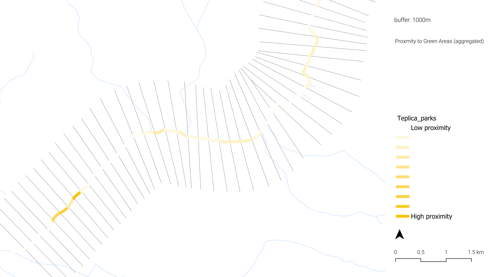

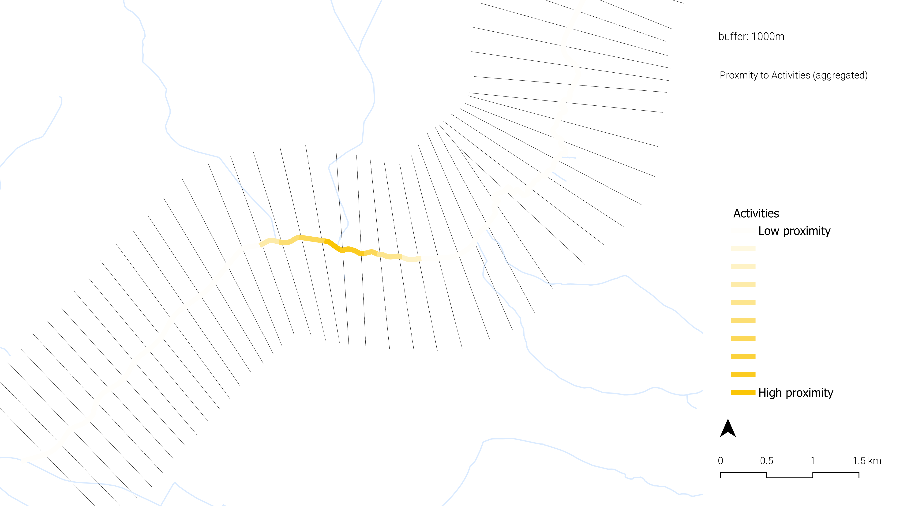

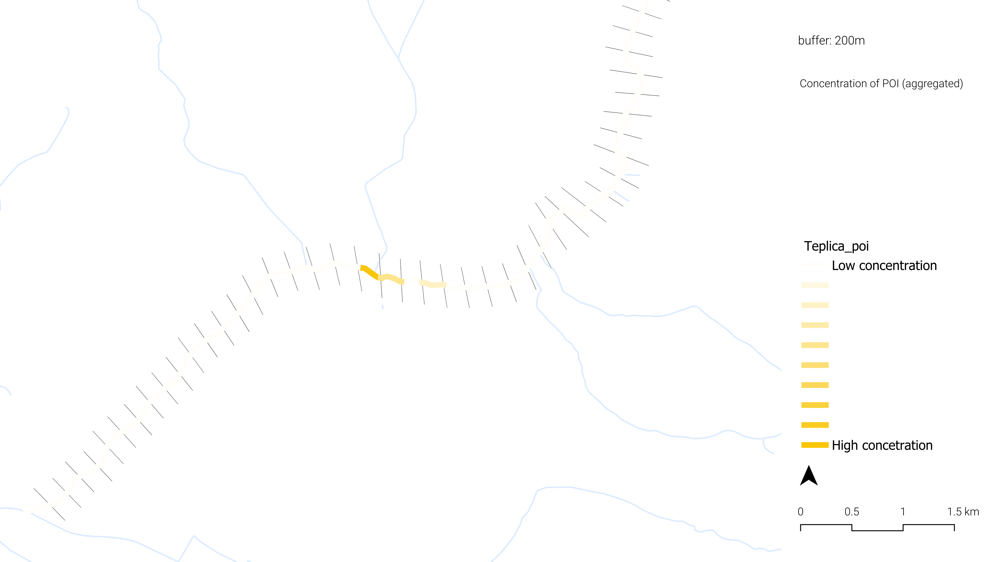

**Climate Adaptation**

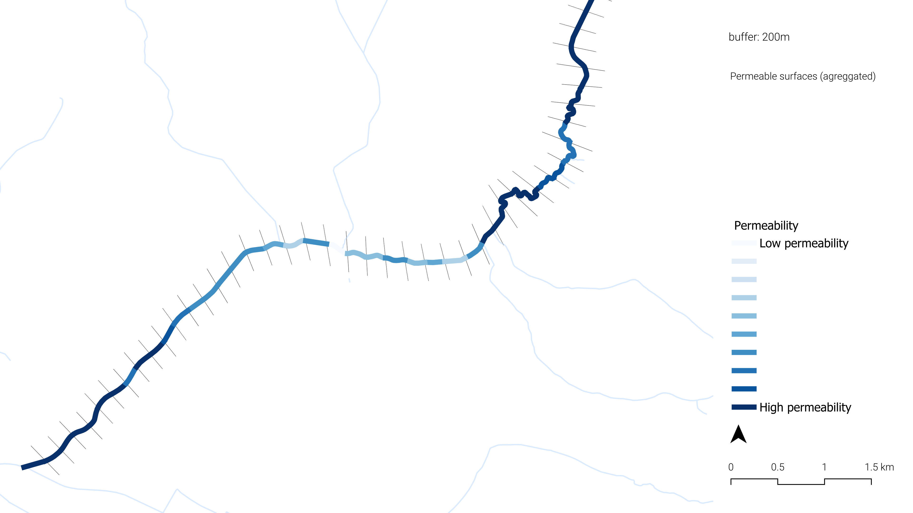

\

\

#### Aggregated result

**For each category**

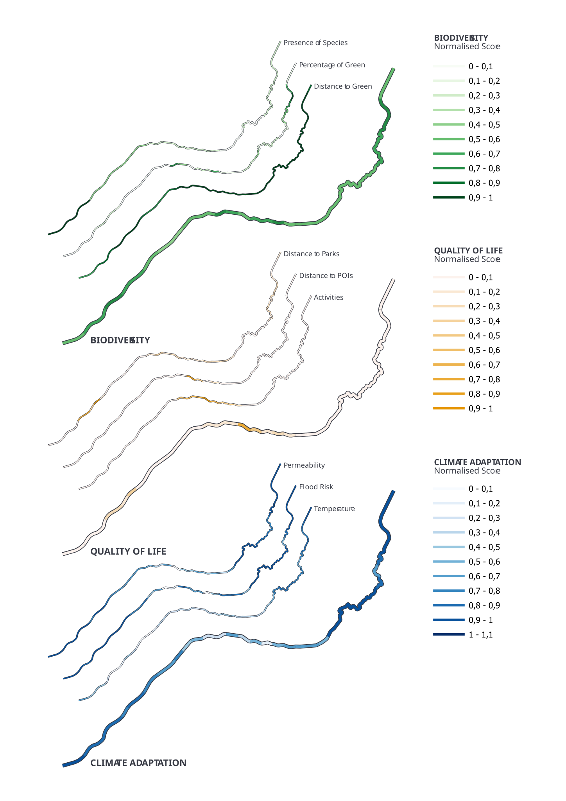

**All categories combined**

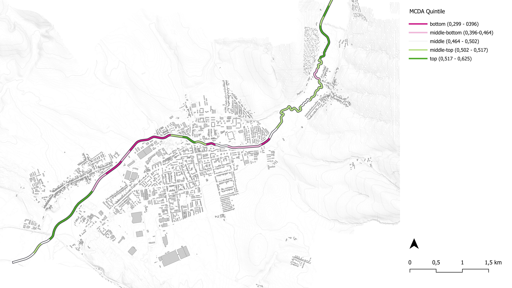

### Typology

#### Clustering results

**map**

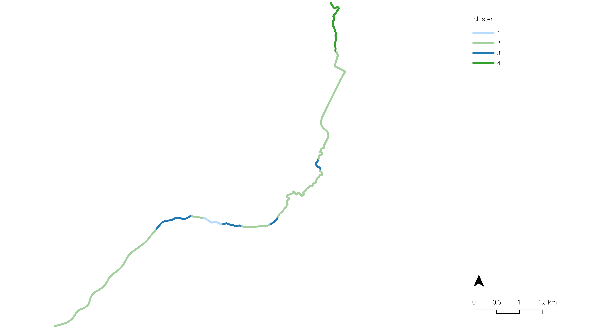

**central value of each cluster**/

| Type | Connectivity to green | rank | Concentration of POI | rank | Less impact from flood | rank |
|-----------|-----------|-----------|-----------|-----------|-----------|-----------|
| 1 | 1.00 | 1 | 0.74 | 1 | 0.61 | 3 |
| 2 | 0.89 | 3 | 0.12 | 3 | 0.95 | 2 |
| 3 | 0.95 | 2 | 0.44 | 2 | 0.34 | 4 |
| 4 | 0.26 | 4 | 0.00 | 4 | 1.00 | 1 |

#### Interpretation of each cluster

**interpreted value and recommendation**/

| Type | Connectivitity to green | Concentration of POI | Anticipated impact from flood | Description |
|---------------|---------------|---------------|---------------|---------------|
| 1 | next to green | high | medium-high | best condition for biophilia, need a plan for preventing flood |
| 2 | distant to green | low | low | green space needs to be extended, more POI can be added |
| 3 | close to green | medium-high | high | urgent need for preventing flood |
| 4 | far from green | none | none | lots of potential for big parks and activities |

**possible example of intervention** /

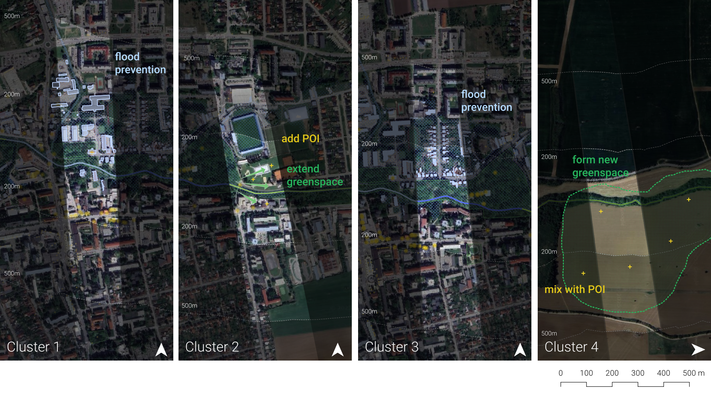

## Discussion

During the research, some challenges were encountered, which had an impact on the validity of the results. A first obstacle was the lack of data and difficult data discovery on the various Slovak geoportals. Furthermore, the data was not always in the desired format, which made processing it more time-consuming than anticipated. All this combined made it so for a lot of variables approximations were used that might not be an accurate reflection of reality. For future research it would be beneficial to be more familiarized with the Slovak data landscape and explore more options outside of Slovakia, for example international satellite data.

The choice of spatial unit further adds uncertainty. The 200m intervals that were chosen, while not bad, are arbitrary and if the intervals started a couple meters earlier on the stream or a couple meters later, the results would be different, due to the different divisions of the area. Also choosing different intervals of 100m or even 50m can have different outcomes where the focus is more on the microclimate around the stream and the interventions could be more focused. Also the choise of interval affects the buffer used for each criteria.

However, this approach may not fully reflect the habitability for different species. The total size of contiguous green spaces might be more significant than the mere percentage within a buffer. A potential improvement would be to assign ecological value or rank to each green space patch and create a new indicator that reflects both the quality and amount of green space intersecting each unit.

The way of weighing the different values for the three categories (Biodiversity, Quality of Life and Climate Adaptation) was not accurate or based on any scientific methods. The values were just given by us depending on how we perceived the criteria in relation to the overall theme of Biophilia. Although we understand that this might be the case in this kind of analysis when using the Satty matrix, a more holistic approach would be better. Another option might be to have different individuals grade the values and have different matrixes that can later be compared for a more accurate measurement. On top of that different methods of weighing data could have been used to see for similarities or differences, however due to the lack of only one method was used.

Finally, other methods for deciding variables to cluster on could be considered. Right now the variables were chosen based on the importance of their weights. However, a more robust method could be to apply forward or backward search based on the within-class and between-class scatter matrix. Furthermore, a principal component analysis could help reduce the number of variables and improve the accuracy of the cluster, at the cost of a simple interpretation.

## Conclusion

In the context of urban stream restoration, a case study was performed to assess “what parts of the Teplica stream have the most potential for human-nature connectedness and to create a biophilic environment?”. To translate this complex question into a measurable index, two methods were employed, namely a Multi-Criteria Decision Analysis (MCDA) and a Typology Analysis using k-means clustering.

First, three equally important domains were established: biodiversity, quality of life, and climate adaptation. Each of these domains contributes in their own specific way to the main topic of the research. For each domain, measurable sub-criteria were decided upon and weighted based on importance. Data was aggregated on 200m segments of the Teplica stream.

Afterwards a Typology Analysis was performed, using the three most important criteria from the MCDA, based on relative weight. Using a k-means clustering approach, the stream segments were divided into four distinct clusters

The most important finding was that the urban segments in the center of Senica scored worst on human-nature connectedness. These areas correlated with the third typology, which featured close proximity to green spaces, but only medium proximity to points of interest and high impact flooding. This indicates the need to improve flood prevention in these areas, which then could create more opportunities for urban development.

Initially it was assumed that more urban areas would score better on human-nature connectedness, since they offer more facilities like parks and activities, compared to more agricultural regions. However, this is also heavily correlated with an increased risk of flooding, which offset those benefits.

Overall, our research showed it was also possible in smaller communes to create a framework to assess human-nature connectedness in the context of urban stream restoration. While the data limitations introduced some uncertainty in the results, the analysis remains a valuable tool to address issues facing smaller communities and improve human wellbeing surrounding urban streams and include them into the landscape rather than ignore them.
