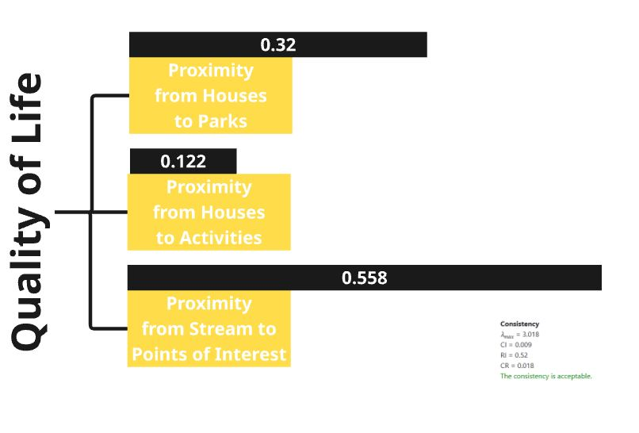
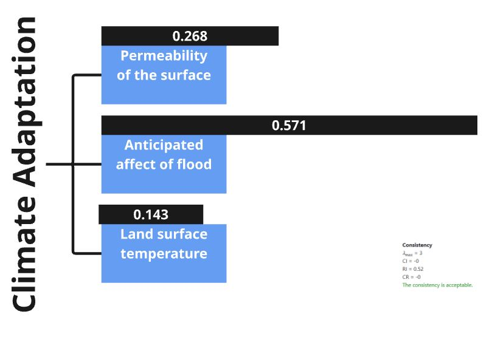
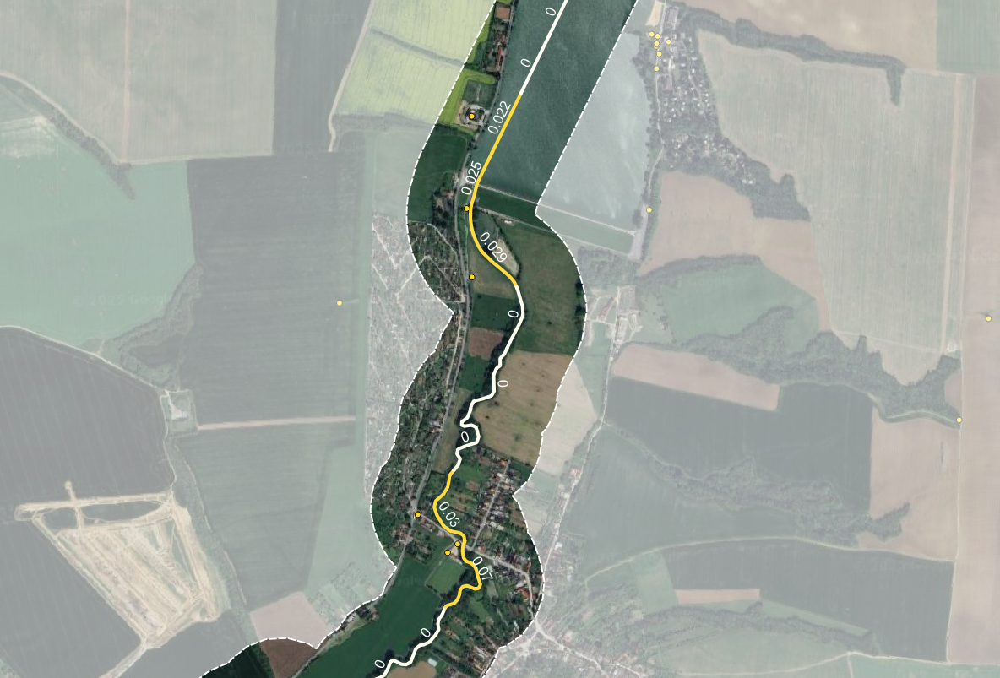

## 1. Introduction

#### 1.1 The case of Teplica

Through the Slovak city of Senica, near the Czech border, flows the water stream Teplica. Due to economic pressures the stream has been heavily altered and has been rendered invisible and insignificant in the urban landscape. Currently, the Teplica is struggling with several problems, namely poor flood handling, poor morphological and ecological quality, low flow during dry periods, an upstream dam, and poorly utilized public space (Škrinár, 2025). The city of Senica is taking steps towards the restoration of this stream serving as an exemplary project within the 'ReBioClim-project'. This EU project aims to restore urban streams while focusing on both biodiversity, climate change, and liveability in cities (City of Senica, 2024a).\
\
While the Slovak water management company (SVP) focuses mainly on protecting the area against flooding caused by heavy rainfall, more functional access to the water, and improved water flow (City of Senica, 2024b), other goals of the project include improving hydromorphology, ecology and diversity in urban areas, and utilizing the stream for recreational purposes. On the other hand, qualitative and experiential aspects such as human-nature connectedness are given little attention. In order to bridge this gap and ensure a lasting impact of the urban stream restoration, the enquiry in this report is focused on a method to determine the potential for human-nature connectedness along the Teplica stream.\

![\[Figure 1\] Objectives of Urban Stream Restoration](image/introduction_1.jpg)

#### 1.2 Research Questions

-   **Research Question :** What parts of the Teplica stream have the most potential for human-nature connectedness to create a biophilic environment?

##### 1.2.1 Human-nature connectedness and its relevance to urban stream restoration

Human-nature connectedness challenges the idea of human superiority over nature,while strengthening the outlook that humankind is a part of nature. Research has shown that this sense of connectedness cannot be created through education only (Spiller, 2024). Spatial composition plays an important role in this process where people must come into direct contact to build a strong relationship with their natural environments.

A theory that has gained recognition in recent decades and is often associated with human-nature connectedness is the 'biophilia' hypothesis (Bhaskar, 2023; Lefosse et al., 2023). This hypothesis states that humans have an innate tendency to seek connections to nature (Grinde & Patil, 2009; Wilson, 1984). This connection is supported with evidence from multiple different fields of study (Grinde & Patil, 2009). The results from several of these studies show a strong connection between human-nature connectedness and an increased human health and wellbeing. This connection is not just physical, but also cognitive, emotional and biophysical (Ives et al., 2017).

Biophilic design, based on the biophilia hypothesis focuses on reinforcing the relationship between humans and the natural world through the creation or strengthening of biophilic places (Da Silva et al., 2021). Human-nature connectedness forms the starting point of this approach. It proposes to utilize green infrastructure to improve ecosystem health and human wellbeing. These places have shown great potential in different ways. They increase social interaction, as people view them as places of improved livability and sociability (Lefosse et al., 2023). Biophilic places also strengthen social cohesion, as they positively influence the perceived social cohesion, as well as facilitate more (semi-)social activities that strengthen community bonds. Another important effect of biophilic places, and the subsequent increase in regular experiences of nature, is that they raise environmental awareness and encourage a more sustainable way of living. In the long term biophilia can aid ecosystem conservation efforts (Bhaskar, 2023). People who are connected to nature and have a strong relationship to nature are more likely to participate in more sustainable behavior and to support ecosystem and biodiversity conservation efforts.

By determining how biophilic a place is, its degree of human-nature connectedness for the people inhabiting the space can be analysed. The amount of biophilic integration can show which places have the largest need for improvement and which places are already performing well. Three sub-research questions stemming from the objectives of urban stream restoration - Biodiversity, Quality of life and climate adaptation are explored through the lens of biophilic integration for the Teplica.

##### 1.2.2 What is the effect of biodiversity on biophilic integration?

While biophilic integration mainly focusses on connecting people to nature, the importance of biodiversity cannot be overlooked (Lefosse et al., 2023). Streams are complex ecosystems and all the different present species contribute to the complex system that makes this ecosystem (Bhaskar, 2023). Biodiversity therefore is of vital importance in protecting this ecosystem from collapse. In assessing the need for change in the areas around streams, it is thus important to also look at indicators for biodiversity and ecosystem functionality.

By analysing biodiversity, the necessary creation or dedication of ecological networks that can provide more ecosystem services can be determined (Lefosse et al., 2023; Ranta et al., 2021a). Biophilic integration has shown great potential in reinforcing urban biomes that can act as biodiversity incubators through an increase in natural repopulation of plant and animal species (Bhaskar, 2023; Panlasigui et al., 2021).

##### 1.2.3 How can quality of life be enhanced through biophilic integration?

As explored in the earlier sections, the biophilia hypothesis essentially advocated for a stronger relationship between people and their natural environments. With the growing climate risks in urban areas, many cities are adapting a more nature inclusive approach towards urban development. The biophilic cities movement provides a vision of a future where citizens’ ethos has shifted to embrace nature, through positive daily engagement with nature, re-establishment of social and cultural connections with nature, and participation in stewardship (Panlasigu et.al, 2021).

To ensure a long term sustainability of the urban stream restoration, it is important to identify the people living around the stream as its custodians, who would gain numerous benifits to health, well-being, fostering a sense of community and an improved recreational life. Improved quality of life will in turn ensure a more aware generation of people that show an attitude of responsibility towards the stream and its surroundings.By analysing the existing modes of human-nature connectedness along the stream, areas for potential action can be determined.

##### 1.2.4 How does microclimate affect biophilic integration?

Another way in which biodiversity and biophilic integration are linked is through microclimate ecosystem services (Lefosse et al., 2023). The amount of biophilic integration relies on the ecosystem services a local ecosystem can provide. Reinforcing ecological networks, increases ecosystem functionality and therefore the amount of biophilic integration. By having more diverse natural elements, both green and blue, containing multiple different species, the environmental impact of a place is enhanced. Different species have different cooling, air-, soil- and water purification, and wind regulating properties. With these species working together, and sometimes even positively affecting the properties of other species, their impact can grow even further. The more biodiverse a place is, the more biophilic it can be, and the more it can improve human-nature connectedness. By analyzing the performance of the existing microclimate areas that need action can be determined.

## 2. Methods

#### 2.1 MCDA

The first method of analysis for biophilic integration of the Teplica used in this report is the Multi-Criteria Decision Analysis (MCDA). This uses classification of the main objective into multiple criteria and sub-criteria to mathematically formalise and aggregate the data contained in each criteria within the definition of a spatial unit. This data is then normalised for comparison. The criteria are weighted based on urgency and their relevance to the overall objective of biophilic integration in the urban stream restoration. Resultant map which is a combination of the weighted criteria is presented in section 3 of the report.

![\[Figure 2\] MCDA hierarchy tree](image/mcda_tree.jpg)

##### 2.2.1 Units

To evaluate these criteria for the Teplica stream, a spatial unit needed to be chosen. The first option was to tile the plane around the stream using either squares or hexagons, and use every tile through which the stream flows to aggregate data. However, the Teplica stream is quite small and using such units requires a very coarse scale to meaningfully aggregate data, due to which the desired spatial detail could not be achieved. The second option was to use points on the stream and buffer in a set radius around them. However, this method averaged most criteria too much to the point it was hard to get a meaningful distinction between the points. In the end, a compromise was selected; the stream was divided into 200m intervals and areas were then buffered out perpendicular to the stream, without overlapping. To achieve a good result the stream was first simplified, due to which some parts might not fully align with the stream, but the overall quality of the zones was improved.

The 200m interval was chosen because it divided the stream into appropriate size for the conduction of this type of analysis, taking into consideration the overall size of the river. Depending on the situation different intervals could be chosen and the results will also differ.

An important factor to consider was that every criteria might have a different spatial influence. Some criteria work on a very local scale, like temperature, which is only relevant in a small area around a stream or a green space, while others like presence of species require a larger area to be relevant. To account for this, different buffer distances were chosen for every criterion. How exactly these were determined is further explained in the following section of the relevant criterion.

![\[Figure 3\] Spatial Units](image/units.jpg)

##### 2.1.2 Criteria

For the MCDA, the analyses are split into three main categories: quality of life, biodiversity and climate change. For each category a couple of analyses are done that give an indication of the human-nature connectedness around the stream. Based on that we can give an indication of where change is needed the most to improve this relationship. The following table shows details for each criteria along with the buffer and weights used.The data sets used for each sub-criteria, its processing and normalisation are explained under the following sections.

![\[Table 1\] Criteria Overview](image/MCDA_table.png)

###### 2.1.2.1 Biodiversity

The first category of evaluation is Biodiversity. To determine the amount of biodiversity of the area around the stream three aspects are focused on. The first two are related to the theory of island biogeography (MacArthur & Wilson, 2001). It states that the larger a green area is, the more biodiverse it will be (Conor & McCoy, 2013). This green area size is determined by two factors: the size of a single continuous green area and the interconnectedness between green areas. To determine the potential biodiversity around the stream, the percentage of green space surrounding the stream is being analyzed, providing an indication of the size of the green area. For interconnectedness, the connectivity between green areas and streams is analyzed, thereby extending the concept of interconnectedness to include interactions between land and water ecosystems. After this analysis, the presence of different species in the area around the stream is also examined, offering a more reliable indication of the actual biodiversity currently present.

**Biodiversity 1** \| Percentage of green

In this analysis, the ratio of green space to total area serves as a proxy for assessing the amount of natural habitat near the Teplica stream. Using percentage as an indicator allows for standardized comparison across spatial units with differing sizes and characteristics.

To calculate this ratio, the buffer distance is a crucial factor. A buffer of 500 meters was applied, as this range effectively includes most of the surrounding green spaces. Green areas were intersected with the spatial units with 500m buffer, creating new layer that represents the amount of green space within each unit. This intersected green area values were then joined to the buffer layer, enabling the calculation of the percentage of green for each unit. The formula below used for final value.

> Percentage of green = (intersected green area) / (500m buffered unit area) \* 100

Since the green space percentages approximately range from 0% to 30%, the values were normalised by dividing by 30, using the following formula.

> Normalised value = (Percentage of green)/30

However, this approach may not fully reflect the habitability for different species. The total size of contiguous green spaces might be more significant than the mere percentage within a buffer. A potential improvement would be to assign ecological value or rank to each green space patch and create a new indicator that reflects both the quality and amount of green space intersecting each unit.

**Biodiversity 2** \| Connectivity to green

This section evaluates the interconnectivity between natural environments. As each unit corresponds to a section of the stream, the distance to the nearest green space from each stream unit is adopted as an indicator, reflecting how closely water ecosystems are linked to the land habitats.

Accordingly, this distance-based indicator supplements area-based criterion by capturing the spatial accessibility of natural areas from the stream. Even if a considerable amount of green space exists, it may have limited ecological value if it is located too far from the stream. This is especially critical for small animals such as frogs, which depend on direct connections between water and land habitats.

For this criterion, no buffer is needed, as the stream line itself serves as the base for calculating distance. Using the processing tool “Shortest Line Between Features”, the shortest distance from each stream unit to the nearest green space was calculated, based on the "osm_greenspace" and "units" layers.

However, when normalising, larger distance indicates weaker connectivity between stream unit and green space nearby. Therefore, the values are inverted to ensure that higher normalized scores reflect stronger connectivity. As a result, the following formula was applied:

> Normalised value = 1 - (value - minimum) / (maximum - minimum)

Since the minimum distance was 0, the formula simplifies to:

> Normalised value = 1 - (value / maximum)

This method produces a normalized score between 0 and 1, where a value of 1 represents the shortest distance (i.e., highest potential connectivity), and values closer to 0 indicate increasing distance from green spaces. This approach directly reflects the inverse relationship between distance and ecological connectivity, where farther distances correspond to lower connectivity potential. Compared to the previous quantile-based method, this continuous normalization may better capture the steep decline in connectivity that occurs with increasing distance from green spaces.

**Biodiversity 3** \| Presence of species

It is worth noting that the presence of ecological corridors near or within urban areas, is one of the important things in biophilic cities. Species present in the area are a direct indicator of the presence of varied habitats and ecological areas in the city. The findings from these could then be used to find areas lacking biodiversity in order to improve diversity in them.

A buffer of 2km is applied to this criterion considering the movement of fauna, which includes mammals and reptiles. This buffer area also includes parts of forest surrounding the east of Senica. Data on a total of 9 distinct faunal species (sourced from the Slovak atlas) was merged to form a layer containing count of each of the species. This was intersected with the spatial buffer to count the number of distinct species in each buffer unit, 9 indicates the highest diversity whereas 5 is the lowest count for diversity of species per unit. The values were also aggregated to the stream segments to see how this is translated to the spatial unit.

> Normalise value = (value – min value)/ (max value - min value)

The range of species count is classified into ten quantile-based groups to maintain homogenity while comparing with other criteria. A score of 0 – 1.0 is assigned to each group ranging from lowest biodiversity count to the highest.

###### 2.1.2.2 Quality of Life

The second category of evaluation is Quality of Life where different criteria have been created and evaluated to assess the current situation in Senica and also understand if and where there is potential for future changes. The criteria used to evaluate the situation are Proximity to Green Spaces , Proximity to Activities and Concentration of Points of Interest.

These criteria in order are used to describe how well connected are the people with the green spaces, what is the daily movement of the people and if there is something that attracts the people to the stream of Teplica.

**Quality of Life 1** \| Proximity to Parks

This criteria describes the distribution of green spaces in the area and their proximity to surrounding buildings. The analysis was conducted using the Attraction Reach function in QGIS, which calculates how many parks are accessible from each building within a walking distance of 500 meters. This threshold is commonly used to represent a comfortable walking distance in urban planning. To enhance the accuracy of the analysis, greater weight was assigned to larger green spaces, based on their total area. This weighting approach is supported by the concept of biophilia, which emphasizes the human need for connection with nature. Research shows that larger green spaces tend to be more biodiverse, thereby offering stronger biophilic benefits (Conor & McCoy, 2013). This justifies prioritizing them in the accessibility calculation.

The unit buffer used is 1000m in order to include most of the city of Senica in order to provide a broader view of green space attraction beyond immediate riverfront areas. The outcome from this analysis was later normalised to be comparable with the other criteria. The method used for normalising is:

> Normalise value = (value – min value)/ (max value - min value)

This data is further aggregated onto river segments by intersecting the buffer units with the Teplica segments in order to have all the data in the same unit of analysis.

**Quality of Life 2** \| Proximity to Activities

The second criterion examines the presence of activities within the urban area to better understand how people interact with and move through the city. Various types of activities, such as churches, commercial spaces, and offices, were taken into account. An Attraction Reach algorithm, similar to the one used for assessing proximity to parks, was applied to calculate how many activity locations are accessible within a 500-meter walking distance from each building. This method provides valuable insights into potential movement patterns and highlights areas that may attract higher foot traffic. When combined with data on green spaces and parks, it contributes to a more comprehensive understanding of urban liveliness and accessibility.

The unit buffer used in this case was also 1000m around the stream to provide a citywide perspective on activity distribution, rather than limiting the analysis to areas immediately adjacent to the stream.The result of the Attraction reach algorithm where joined by location summary with the 1000m buffer and later normalised using the same method as before.

> Normalise value = (value – min value)/ (max value - min value)

Additionally, the data was aggregated into stream segments, again so that everything is on the same unit of analysis to be comparable with each other which is also the point of the MCDA method.

**Quality of Life 3** \| Concentration of P.O.I.

The third and final criterion used in this analysis is the concentration of Points of Interest (POIs) along the Teplica stream. These POIs encompass a wide variety of features, including recreational activities, shops, monuments, benches, public artworks, and other amenities that contribute to the vibrancy of public space. To evaluate their impact, only POIs located within a 200-meter buffer along the stream were considered. Additionally, POIs were graded based on their proximity to the stream, with those closer to the watercourse given a higher value. This approach reflects their potential to draw people toward the stream, thereby fostering greater interaction between the urban population and the surrounding natural environment.

To perform this analysis a series of points was generated along the geometry of the stream, spaced at 10-meter intervals in order to use the Attraction Reach algorithm from POI to points along the stream. This resolution is appropriate given the scale of both the stream and the urban context. The Attraction Reach function was then applied to the POI and that was joined by location summary into the 200m buffer units. In order to be on the same threshold the units were normalised with the same method as before.

> Normalise value = (value – min value)/ (max value - min value)

While also aggregated into the stream segments by interesting the buffer with the Teplica stream.

The outcome highlights a notable concentration of POIs in the city center, suggesting that this area is already a focal point of activity. This also provides insight into potential zones for enhancing green infrastructure, where increasing greenery could further promote interaction with the stream and strengthen the human-nature relationship in urban settings.

###### 2.1.2.3 Climate Adaptation

TThe third category of evaluation is Climate adaptation. This set of criteria is used to understand how well the area can adapt to extreme changes in the weather conditions. This is also important to ensure that the green spaces will preserve their qualities and be available in order to maintain the connectivity with the people and to promote biophilia.

For climate adaptation 3 criteria were used in order to get a better understanding of the area. These criteria are Permeability of the ground, Flood Risk and Land Surface Temperature.

**Climate Adaptation 1** \| Permeability

This criterion evaluates the ground’s ability to collect and absorb rainwater. To estimate this, it was assumed that all non-paved areas represent permeable surfaces capable of water infiltration. A land cover image of the city of Senica was used to identify paved areas, which were then isolated using the Raster Calculator tool in QGIS. To focus the analysis on areas relevant to water absorption near the stream, a 200-meter buffer zone was created around the stream network. The land cover image was then clipped to this buffer zone, narrowing the scope to a meaningful spatial scale. Using the Zonal Statistics tool, the proportion of permeable versus impermeable surfaces was calculated for different zones along the stream by counting the pixels of the image that indicate the paved areas. Afterwards these were joined by location summary with the 200m buffer and later normalised with a similar method as before.

> Normalise value = (value – min value)/ (max value - min value)

The normalised values showed the permeability of the ground however this scale indicated that high values are less permeable. So the values were inverted so that higher values indicate more permeability. The inversion was done using this method.

> 1 - "Normalised value"

Finally, the results were aggregated to the corresponding river segments for further analysis. .

**Climate Adaptation 2** \| Impact of Flooding

To assess the impact of flooding, the amount of buildings affected by a q100 was estimated. First the flood risk map was retrieved from the mpt.svp.sk gis server. Multiple types of flood risk maps were available, namely the q10, q100 and q1000 maps. These respectively indicate the likeliness of such a flood, for example the q100 indicates a flood that would on average occur every 100 years. The q100 was chosen, since it is still a relatively common occurrence, and the impact is significant enough to take measures against. The flood basin reaches at most 500 meters away from the banks of the Teplica, therefore the buffer was chosen as such.

Another important point to consider is that there are multiple ways to determine the impact of a flood. For example, the total land area affected, the amount of built-up land affected or the amount of buildings affected. Due to the urban structure of Senica, of which a large part consists of industrial buildings with large footprints, the total number of buildings was chosen as a measure since it more closely measures the amount of people affected by a flood. A population density map would have been preferable, however, none was found at a sufficiently high resolution.

So the total number of buildings was counted per unit buffer, the values were normalised as usual and the data was aggregated into the river corresponding segments by intersecting the buffer used with the stream.

**Climate Adaptation 3** \| Land Surface Temperature

For the final criterion the Land Surface Temperature was calculated. The data was retrieved from the USGS Landsat 8-9 Level 2 satellite data. Particularly, the B10 band measures thermal infrared and is therefore representative of land surface temperature. The data is a snapshot of a sunny day in May 2025.

The buffer was chosen according to a study by Wu, Zhijie & Zhang, Yixin. (2019) which found green spaces within 200m had a significant effect on urban land surface temperature.

So the average temperature was calculated in the unit buffer of 200m around the stream and the same process with the rest of the analysis was conducted. First the values were normalised and then aggregated to find the average temperature on each stream segment.

> Normalise value = (value – min value)/ (max value - min value)

##### 2.1.3 Criteria Weighting

Weighting of the criteria used in MCDA is carried out using the saaty matrix (Fuzzy AHP, n.d.). This is done separately for each criterion where the three sub-criteria within each criterion are weighed against each other based on its relevance to the overall objective of creation of a biophilic environment. It is also important to note that the weighting takes into account reliability of the data source for each sub criteria. Eigenvector(non-fuzzy) calculation method is used for all the weighting. 

::: {layout-ncol="3"}
![\[Figure 4\] Criteria Weighting](image/weighting_biodiversity.JPG){width="312"}

{width="312"}

{width="312"}
:::

For the 1st criteria of Biodiversity, distance of green spaces from the stream is rated the highest as it has a direct impact on the stream health, and potential access of human and non-human species.

In Quality of Life, the proximity of points of interest such as cafes, park benches, etc from the stream is rated the highest since it has the highest potential of attracting people which ensures human-nature connectedness.

For Climate Adaptation, anticipated flood affected areas carry the highest weight as this directly affects the surrounding built environment. Higher risk of flood would mean people moving away from the stream which counters the objective of improved human nature connectedness with the stream.

The three main criteria - Biodiversity, Quality of Life and climate adaptation are considered equally important to arrive at a concluding map presented in section 3 of the report.

#### 2.2 Typology construction

##### 2.2.1 Objective and approach

While the MCDA offers a structured evaluation of the Teplica stream through distinct criteria related to biodiversity, quality of life, and climate change, it has limitations in capturing how these criteria interact within each spatial unit. MCDA focuses on individual indicator performance and their weighted aggregation, but it does not reveal the relationships among indicators or the typical combinations of conditions observed along different segments of the stream.

To move from evaluation toward actionable strategies for urban stream restoration, it is necessary to understand not just where the stream performs poorly or well on individual criteria, but what kinds of local conditions are present and recurring across the stream. As a result, typology construction is needed to identify meaningful patterns of combined indicator values that characterize the current state of the stream.

In the case of the Teplica stream, we work with 54 spatial units. Ideally, each unit would be assessed individually and provided with a tailored design intervention. However, this level of resolution is often impractical in real world applications. Instead, recurring patterns of indicator combinations can be detected, grouping similar units into types and propose strategic directions for each type. To achieve this, k-means clustering will be applied, a method that forms cluster of spatial units based on the similarity of selected indicator values.

This approach not only simplifies the complexity of stream conditions but also facilitates a typology-driven restoration planning process, where each cluster can inform a targeted and context-sensitive intervention strategy.

##### 2.2.2 Script-Based Implementation

The entire typology construction process was implemented in R. To support reproducibility of research, key parts of the R script are embedded throughout this section.

Readers can open appendix_clustering follow each steps of the analysis by referring to the embedded code blocks.

##### 2.2.3 Typology Setup

**packages for clustering**\
Two R packages were required for this process: sf for handling spatial data and stats for performing k-means clustering.

-   `sf` : processing vector data
-   `dplyr` : selecting and transforming data.

**spatial unit**\
To perform the typology analysis, same spatial unit used in the MCDA is adopted: 54 segments along the Teplica stream dvided equally into 200m length. This consistent unit length ensures comparability between both analyses and allows the typology to directly build upon the evaluation framework established earlier.

**variables**\
Three variables were selected and standardized from the MCDA criteria to serve as inputs for the clustering process;

-   Connectivity to green (weighted 0.5 for biodiversity)

-   Concentration of POI (weighted 0.558 for Quality of Life)

-   Impact of flooding (weighted 0.571 for Climate Adaptation)

For each of the three main categories;biodiversity, quality of life, and climate change, the criterion with the highest weight was chosen, as it best represents the most influential factor in determining the biophilic value of each stream unit.

These variables are stored in the file `MCDA.gpkg`, with the following field names:

-   `Connectivity`: field representing connectivity to green. A normalized value based on the distance to the nearest green space.Since the values are inverted, higher values indicate closer proximity and stronger potential for connectivity.

-   `POI`: field representing concentration of POI. A normalized value based on concentration of Points of Interest (POI) within a 200m buffer. Higher values indicate higher concentration of POI

-   `FloodRisk`: field representing Impact of flooding. A normalized based on number of buildings intersect with flood area. Since the values are inverted, higher values indicate less anticipated impact from flood.

##### 2.2.4 Clustering

**Determine optimal k**

'k' in k-means clustering refers to number of clusters. Inertia is used as the indicator for finding optimal k, which means total distance between points from cluster centers. However, this does not mean that k with lowest inertia will be selected, as inertia constantly decreases while k increases. Instead, elbow method will be used. In elbow method, optimal k is where inclination dramatically changes in the graph showing relationship between k and inertia.

Elbow plot for this research is shown below:

![\[Figure 5\] elbow plot](image/ElbowPlot.png)

Based on elbow plot, the optimal number for clustering is 4, as the inclination changes dramatically at 4.

**k-means clustering**

For clustering, k-means algorithm is used. The clustering result is combined with spatial unit data, assigning cluster number between 1 to 4 for each spatial unit.

##### 2.2.5 Cluster Centers

To interpret character of each cluster, center value for each variables should be extracted. Then center values are compared to see difference between each clusters. The research focused on variable with low values for each clusters to figure out appropriate interventions needed for each clusters.

## 3. Results

#### 3.1 MCDA

##### 3.1.1 Analysis for each criterion

###### 3.1.1.1 Biodiversity

**Biodiversity 1** \| Percentage of green

The distribution of green coverage among the stream units varies between 0% and 30%, indicating a relatively low to moderate presence of vegetation throughout the area.

::: {layout-ncol="2"}
![\[Figure 6\] Biodiversity 1 - Percentage of green: buffer of 500m](image/percentage_1.png){width="480"}

![\[Figure 7\] Biodiversity 1 - Percentage of green: normalised](image/percentage_2.png){width="480"}
:::

According to Biophilic Planning Indicators, a minimum of 10% of each area should be covered by trees or vegetation (source to be added shreya).In the case of Teplica, only 9 out of 54 units exceed this standard. The units with more than 10% green coverage are generally those that intersect with larger green spaces, such as gardens (Zahrádková osada Kunov), parks (Městský park), or unused open green areas.

**Biodiversity 2** \| Connectivity to green

The shortest distances from stream units to adjacent green areas range from 0 to approximately 2,000 meters. Notably, 16 out of 54 units are located directly within green spaces, even if they are relatively small, which results in maximum connectivity scores for those segments.

::: {layout-ncol="2"}
![\[Figure 8\] Biodiversity 2 - Connectivity to green: distance to closest green](image/distance_1.png){width="480"}

![\[Figure 9\] Biodiversity 2 - Connectivity to green: normalised](image/distance_2.png){width="480"}
:::

A few unusually long distance values appear in the northeastern stream segments, which seem to result from incomplete green space information in `osm_greenspace` dataset. In these cases, presence of vegetation are shown in satelite image, but the corresponding vector data does not capture these areas. This limitation may lead to an underestimation of connectivity in those specific units.

Nevertheless, overall connectivity to green space across the stream corridor is relatively strong. When assessed using normalized values, 49 out of 54 units scored above 0.5, indicating that the majority of the stream segments maintain a moderate to high level of integration with surrounding green infrastructure.

**Biodiversity 3** \| Presence of species

9 habitat data extracted from the Atlas of Slovak were overlaid to assess the cumulative presence within a 2 km buffer around each stream unit. Selected species are those whose habitat do not uniformly cover the entire Senica area. The resulting values range between 5 and 9, though only four discrete values (5, 6, 7, and 9) were observed.

::: {layout-ncol="2"}
![\[Figure 10\] Biodiversity 3 - Presence of species : buffer of 2km](image/species-1.png){width="480"}

![\[Figure 11\] Biodiversity 3 - Presence of species : normalised](image/species-2.png){width="480"}
:::

Units in the southwestern part of the study area show the highest levels of species presence (score 9), while the values tend to gradually decline as the units extend further northeast.

Interestingly, one of the lowest scoring areas (normalized value below 0.2) is located not at the most distant edge, but rather bit more southern from the edge, where the stream land overlaps with less vegetated open field.

![\[Figure 12\] Biodiversity 3 - stream units with lowest score](image/species_lowestpart.png){width="960"}

From Google map street view, this area contains tall transmission towers and high-voltage power lines, which may negatively affect species habitat suitability due to noise, electromagnetic fields, and habitat fragmentation.

![\[Figure 13\] Biodiversity 3 - street view of lowest unit](image/species_powerline.png){width="960"}

###### 3.1.1.2 Quality of Life

**Quality of Life 1** \| Proximity to Parks

This criterion measures the spatial proximity and connectivity between each stream unit and nearby parks within a 500-meter buffer zone. Among the 54 stream units analyzed, 31 units recorded a proximity score below 0.1, indicating buildings around stream unit have limited or no direct access to park infrastructure. Units with higher proximity values are mostly concentrated in urbanized areas in the centre, where parks more well-integrated into urban fabric.

::: {layout-ncol="2"}
![\[Figure 14\] Quality of Life 1 - Proximity to Parks: buffer of 1km](image/GreenAreas_1.png){width="480"}

![\[Fgure 15\] Quality of Life 1 - Proximity to Parks: normalised](image/GreenAreas_2.png){width="480"}
:::

Notably, the unit with highest proximity score (ID 49) is not found in the city center, but rather in a peripheral zone. In this area, the northern side of the stream have relatively high proximity with long strip of green and adjacent residential area. However, there are higher proximity in the southern side, which is industrial area with waste water treatment plant, solar farm, and warehouses. Although the area is primarily industrial, its closeness to green spaces may offer opportunities for incorporating recreational or mixed-use elements as part of broader stream regeneration strategies.

![\[Figure 16\] Quality of Life 1 - stream unit with highest score (ID: 49)](image/greenareas_highest.png){width="960"}

**Quality of Life 2** \| Proximity to Activities

This criterion captures the spatial proximity between stream units and nearby buildings with different activities such as churches, commercial facilities, and offices. Among the 54 stream units, 29 units recorded a proximity score of zero, indicating no meaningful nearby human activity nodes within the defined buffer zone. Furthermore, only 8 units achieved a normalized score above 0.2, underscoring the limited distribution of such structures outside urban areas.

::: {layout-ncol="2"}
![\[Figure 17\] Quality of Life 2 - Proximity to Activities: buffer of 1km](image/Activities_1.png){width="480"}

![\[Figure 18\] Quality of Life 2 - Proximity to Activities normalised](image/Activities_2.png){width="480"}
:::

The highest scoring unit(ID 3) is located around Námestie Oslobodenia, a key urban road corridor. The stream unit intersecting this road recorded the maximum proximity value, suggesting a strong spatial integration between the stream and surrounding civic or commercial infrastructure in that zone.

This pattern emphasizes that active built functions remain highly centralized, and the majority of stream segments outside the core urban fabric are only marginally connected to concentrated buildings with activities.

**Quality of Life 3** \| Concentration of P.O.I.

Unlike the previous two indicators in quality of life category, this criterion measures the direct spatial proximity between stream units and nearby Points of Interest (POIs).As such, it captures more relevant interactions between the stream itself and surrounding landmarks, making the result less influenced by the density or presence of built structures around the stream.

Still out of 54 units, 39 recorded a score of zero, indicating that in most cases, stream segments are not spatially connected to POIs. Also, as with previous proximity indicators, the highest scoring unit(ID 3) is located near Námestie Oslobodenia, reflecting the concentration of urban functions in that corridor.

::: {layout-ncol="2"}
![\[Figure 19\] Quality of Life 3 - Concetration of POI: buffer of 200m](image/POI_1.png){width="480"}

![\[Figure 20\] Quality of Life 3 - Concetration of POI: normalised](image/POI_2.png){width="480"}
:::

However, a key distinction of this indicator is its ability to detect localized activity potential even in areas with minimal built infrastructure.For instance, in northern stream units, Proximity to Activities' scored zero, the POI criterion assigns a small but non-zero score, acknowledging the presence of nearby activity points.

::: {layout-ncol="2"}
![\[Figure 21\] Comparison of Quality of Life 2 and 3](image/POI_compare_1.png){width="480"}

{width="480"}
:::

In this way, the POI-based metric complements the other two indicators by capturing stream-activity connections in low-dense areas, making it a valuable component in assessing overall potential of stream for improving quality of life.

###### 3.1.1.3 Climate Adaptation

**Climate Adaptation 1** \| Permeability

This criterion evaluates the surface permeability of the built environment as a proxy for climate adaptation capacity. It is based on the proportion of built-up area within each stream unit, with lower built density translating to higher permeability scores.

::: {layout-ncol="2"}
![\[Figure 22\] Climate Adaptation 1 - Permeability: buffer of 200m](image/Permeabilty_1.png){width="480"}

![\[Figure 23\] Climate Adaptation 1 - Permeability: normalised](image/Permeabilty_2.png){width="480"}
:::

As is commonly observed, urbanized areas near the city center exhibit low permeability, while peripheral stream units show relatively high permeability.

Notably, the stream unit intersecting with Námestie Oslobodenia (ID 3), which previously scored highest in 'Proximity to Activity' and 'Concentration of POI', now records the lowest permeability score.This contrast highlights a critical trade-off: areas with high human activity lacks climate resilience.

Such zones can be priority areas for intervention, where nature-based solutions could be introduced to balance urban functionality with ecological sustainability.

**Climate Adaptation 2** \| Impact of Flooding

This criterion assesses the potential impact of flooding on the built environment, by counting the number of buildings located within anticipated flood zone.Higher scores indicate lower exposure, meaning fewer buildings are at risk, while lower normalized scores reflect a greater number of buildings within flood zones, representing higher potential vulnerability.

Similar to 'Permeability', lower scores tend to be observed in densely urbanized areas, where built-up density increases the impact of direct flood exposure. However, unlike permeability, this indicator more directly reflects potential impact on human, as it accounts the presence of actual buildings with residents.

![\[Figure 24\] Climate Adaptation 2 - Impact of Flooding: buffer of 500m](image\flood_impact.svg){width="960"}

The stream unit intersecting the residential area near Jána Mudrocha Street (ID 13) recorded the lowest normalized score, due to a high number of small-sized buildings located within the floodplain. While each individual building may be small, their cumulative presence suggests a higher concentration of people or property at risk, making this zone especially vulnerable.

::: {layout-ncol="2"}
![\[Figure 25\] Climate Adaptation 2 - Stream unit with highest score (ID: 13)](image/impactofflood_highest.png){width="480"}

![\[Figure 26\] Climate Adaptation 2 - Other units for comparison](image/impactofflood_compare.png){width="480"}
:::

In this sense, the indicator is a meaningful proxy for social exposure to flooding, capturing the reality that a cluster of small homes have more impact on people than a few large structures.

**Climate Adaptation 3** \| Land Surface Temperature

This criterion estimates surface-level heat intensity using Landsat data. For normalization, the values were inverted, so that lower scores reflect higher surface temperatures, indicating greater exposure to heat stress and lower thermal comfort. Align with other climate-related indicators, urbanized areas generally recorded lower scores, consistent with their built-up density and low vegetation cover.

![\[Figure 27\] Climate Adaptation 3 - Impact of Flooding: Buffer 500m](image\temperature.svg){width="960"}

However, a notable exception occurs in the southern part of the study area, where several stream units show exceptionally low normalized scores,including the lowest. Interestingly, these areas are not dense urban cores but rather open lands with minimal built structures.

![\[Figure 28\] Climate Adaptation 2 - stream unit with lowest score](image/temperature_lowest.png){width="960"}

Street-level imagery reveals that these zones are dominated by bare ground and transmission towers, with limited vegetation cover, which likely contributes to elevated surface temperatures.

![\[Figure 29\] Climate Adaptation 1 - street view around lowest unit](image/temperature_street.png){width="960"}

This finding shows that undeveloped or non-urbanized land can still exhibit extreme thermal vulnerability when lacking vegetation, especially trees. In fact, the thermal stress in these units exceeds that of more densely developed areas, highlighting the critical role of vegetative cover in moderating microclimate, regardless of urban density.

##### 3.1.2 Final aggregated result

###### 3.1.2.1 MCDA result for each category

Image below shows aggregated result for each category; Biodiversity, Quality of Llife, Climate adaptation, with normalised result for 3 criteria per category.

![\[Figure 30\] Composition of MCDA](image/MCDAcomp.svg){width="960"}

**Biodiversity**

The composite score for the Biodiversity does not follow a gradual spatial gradient but instead reveals distinct high-scoring units scattered across the study area. This pattern suggests that biodiversity potential is driven less by overall spatial trends and more by localized ecological conditions, particularly the presence and size of adjacent green spaces.

The highest biodiversity score was observed in unit with ID number 5, a stream unit located between two big green spaces.

![\[Figure 31\] Biodiversity - unit with highest value (ID: 5)](image/B_highest1.png){width="960"}

Notably, some of the high-scoring units are located within urban areas,demonstrating that even in densely built environments, proximity to large, continuous green spaces can substantially enhance ecological value.

::: {layout-ncol="2"}
![\[Figure 32\] Biodiversity - unit with highes value (ID: 20)](image/B_highest3.png)

![\[Figure 33\] Biodiversity - unit with highest value (ID: 54)](image/B_highest2.png)
:::

**Quality of Life**

The Quality of Life category demonstrates a clear urban–peripheral gradient, with higher scores concentrated in the city center and markedly lower values toward the outer stream segments. This trend reflects the distribution of civic amenities, built infrastructure, and accessible services, which are typically concentrated in urban cores.

The highest-scoring unit (ID number 3) lies at the intersection with Námestie Oslobodenia, a central urban corridor consistently identified across different criterias, such as 'Proximity to Activities' and 'Concentration of POI'.

![\[Figure 34\] Biodiversity - unit with highest value (ID: 3)](image/Q_highest.png){width="960"}

In contrast, several peripheral units scored zero, particularly those at the extreme ends of the study area. These locations lack nearby buildings or points of interest and are often surrounded by vacant land, resulting in minimal contribution to human-centered livability measures.

::: {layout-ncol="2"}
![\[Figure 35\] Biodiversity - units with 0 value](image/Q_lowest_1.png)

![\[Figure 36\] Biodiversity - units with 0 value](image/Q_lowest_2.png)
:::

**Climate Adaptation**

The Climate Adaptation indicator shows an inverse spatial pattern compared to Quality of Life, with higher scores observed in peripheral areas and lower scores in densely developed urban zones.However, unlike the Quality of Life indicator, which shows clear graduation from city centre, the Climate Adaptation score appears to be more directly influenced by built area.For instance, even in non-central areas such as the vicinity of Kunov, units exhibit low scores due to presence of buildings and hard surfaces.

A particularly notable pattern is seen in several central units—such as ID 13, 17, and 20—which scored especially low.

::: {layout-ncol="2"}
![\[Figure 37\] Climate Adaptation - unit with lowest value (ID: 13)](image/C_lowest1.png)

![\[Figure 38\] Climate Adaptation - units with low value (ID: 17, 20)](image/C_lowest2.png)
:::

This outcome is strongly tied to the high weighting of the 'Impact of Flood' criterion, with these units also recording the lowest scores for 'Impact of Flood'.

###### 3.1.2.2 Combined result of 3 categoties

The image below shows the final composite scores of three categories. The score reveal clear distinctions between stream units in terms of their overall performance across all selected criteria.

![\[Figure 39\] Quintiles of the final MCDA score](image/mcda_quintiles.jpg){width="960"}

The lowest-scoring unit is ID 17, which previously showed significant vulnerability in Climate Adaptation, especially the Impact of Flood. Similarly, ID 13 and ID 20, which were also noted for their low flood resilience, ranked among the bottom-performing units in the overall evaluation.

The highest overall score was recorded in ID 49, an unexpected result given that it did not dominate across most individual criteria.Its most notable strength lies in the Proximity to Park indicator, where it achieved the highest score. Interestingly, this criterion did not carry the highest weight in the Biodiversity category, also in MCDA. Still, combined with moderate to strong scores in other dimensions made score of ID 49 to the top. This outcome underscores the value of balanced multi-criteria performance, where no single dominant factor is necessary to achieve a high composite score.

The frequently mentioned ID 3 unit, which is crossing Námestie Oslobodenia, also scored relatively high overall. Despite its low score in Climate Adaptation, its exceptionally high performance in Quality of Life compensated for those weaknesses.

#### 3.2 Typology

##### 3.2.1 Clustering results

Based on the results of elbow method, the 54 stream units were categorized into four distinct clusters, each representing a recurring combination of ecological connectivity, human activity concentration, and exposure to climate-related hazards.

![\[Figure 40\] Clustering result](image/cluster.png){width="960"}

The distribution of units across the four clusters is highly uneven, indicating that while some typologies are widespread, others represent specialized conditions. Cluster 2 have most common condition, comprising 38 out of 54 units.Conversely, Cluster 1 includes only 2 units, which suggests that these may be extreme or exceptional cases.Likely, Cluster 3 (8 units) and Cluster 4 (6 units) represent intermediate or transitional typologies, capturing zones with distinct but less common combinations of conditions.

| Cluster | Number of unit |
|---------|----------------|
| **1**   | 2              |
| **2**   | 38             |
| **3**   | 8              |
| **4**   | 6              |

\[Table 2\] Number of units for each cluster

The unbalanced distribution highlights the fact that urban stream conditions are not evenly diverse, and that targeted strategies will be necessary for the smaller, more specialized areas.

**central value of each cluster**

The clustering yielded four distinct typologies based on the central values of three key criteria: (1)connectivity to green, (2)concentration of POI, and (3)impact of flood.

These clusters vary significantly in both their internal characteristics and their relative strengths, as shown in the central value and rank in comparison.The overall results are shown in two tables below:

| Cluster | Connectivity to green | Concentration of POI | Impact of Flood | sum  |
|---------------|---------------|---------------|---------------|---------------|
| **1**   | 1.00                  | 0.74                 | 0.61            | 2.35 |
| **2**   | 0.89                  | 0.12                 | 0.95            | 1.96 |
| **3**   | 0.95                  | 0.44                 | 0.34            | 1.73 |
| **4**   | 0.26                  | 0.00                 | 1.00            | 1.26 |

\[Table 3\] Central value of each cluster

| Cluster | Connectivity to green | Concentration of POI | Impact of Flood |
|---------|-----------------------|----------------------|-----------------|
| **1**   | 1                     | 1                    | 3               |
| **2**   | 3                     | 3                    | 2               |
| **3**   | 2                     | 2                    | 4               |
| **4**   | 4                     | 4                    | 1               |

\[Table 4\] Rank for variables

##### 3.2.2 Interpretation of clustering result

Based on central value and rank for three variables, character of each type can be interpreted like this:

| Type | Connectivity to green | Concentration of POI | Impact of Flood | Interpretation |
|---------------|---------------|---------------|---------------|---------------|
| **1** | right next to green | high | medium | best condition for biophilia |
| **2** | distant from green | low | low | most common condition with moderate values |
| **3** | very close to green | medium | high | good condition for biophilia, high risk from flood |
| **4** | far away from green | none | none | no impact from flood, but no condition for biophilia |

\[Table 5\] Interpretation of each type

**Type 1**: best condition for biophilia

This cluster demonstrates the strongest overall performance, ranking first in both connectivity to green (1.00) and POI concentration (0.74).A 1.00 in connectivity suggests that both units in this type are fully adjacent to green space. This type also has outstanding value for POI, with a score nearly double that of the next highest cluster.The result confirms high access to activity nodes from stream.

Despite ranking only third in flood impact, the overall sum of medians and rank-based scores places Cluster 1 clearly above the rest. The rarity of type, with only 2 units belonging to the cluster, may reflect ideal but uncommon spatial conditions, making it a reference type for best-case scenario for urban stream restoration.

**Type 2**: most common and basic condition

As the type with largest cluster,Type 2 likely represents the prevailing condition along the stream. It shows moderate flood resilience, but ranks third in connectivity and POI concentration, indicating that most units in this group have few nearby amenities and weak ecological connection.

This typical, but relatively underperforming typology will be suitable for creating broad-scale baseline improvement strategies, especially in terms of green infrastructure and concentration of different activity around stream.

**Type 3**: good condition, but high risk from flood

Type 3 shows moderate to strong performance in both connectivity (0.95) and POI access (0.44), ranking second in both. However, it ranks last in flood impact, with noticably low value compared to other types (0.34).This indicates that while these areas benefit from ecological and functional proximity, they are also highly exposed to flood risk.

In planning terms, this cluster represents areas with potential for improvement through targeted flood adaptation measures, such as permeable surfaces or flood-tolerant green buffers.

**Type 4**: isolated area with no risk from flood

This type has zero POI concentration and lowest connectivity to green, placing it last in both. However, it ranks first in flood impact, with a central value of 0.00, suggesting either no overlap with flood zones or no built structures at risk, or even no built structures around. In essence, Cluster 4 represents spatially disconnected, undeveloped zones—possibly agricultural, or vacant lands.

Despite their current isolation, these areas present a valuable opportunity for large-scale, transformative interventions, due to the absence of flood risk and existing land-use constraints. Their “blank" condition makes them well-suited for long-term ecological or multi-functional development.

##### 3.2.3 Recommended intervention for each typology

Based on the characteristics of each cluster derived from the typology analysis, tailored intervention strategies are proposed to enhance ecological connectivity, socio-functional quality, and flood resilience, for each stream unit. These recommendations reflect the distinct strengths and vulnerabilities of each cluster type.

| Type | Recommendation |
|---------------------|---------------------------------------------------|
| **1** | Minimal interventions needed, consider minor adjustments for enhancing flood resilience |
| **2** | Expand existing green areas and introduce new activities to improve ecological and social quality |
| **3** | High priority for flood adaptation measures needed due to high vulnerability |
| **4** | Strong potential for large-scale recreational green space development |

\[Table 6\] Recommendation for each type

To visualize how the recommendations may be applied in context, representative units from each typology were selected. The examples demonstrate how spatial and functional improvements could be implemented based on each cluster’s characteristics.

![\[Figure 41\] Suggested interventions for representative units](image/clusters_zoomin.png)

## 4. Discussion

During the research, some challenges were encountered, which had an impact on the validity of the results. A first obstacle was the lack of data and difficult data discovery on the various Slovak geoportals. Furthermore, the data was not always in the desired format, which made processing it more time-consuming than anticipated. All this combined made it so for a lot of variables approximations were used that might not be an accurate reflection of reality. For future research it would be beneficial to be more familiarized with the Slovak data landscape and explore more options outside of Slovakia, for example international satellite data.

The choice of spatial unit further adds uncertainty. The 200m intervals that were chosen, while not bad, are arbitrary and if the intervals started a couple meters earlier on the stream or a couple meters later, the results would be different, due to the different divisions of the area. Also choosing different intervals of 100m or even 50m can have different outcomes where the focus is more on the microclimate around the stream and the interventions could be more focused. Also the choise of interval affects the buffer used for each criteria.

However, this approach may not fully reflect the habitability for different species. The total size of contiguous green spaces might be more significant than the mere percentage within a buffer. A potential improvement would be to assign ecological value or rank to each green space patch and create a new indicator that reflects both the quality and amount of green space intersecting each unit.

The way of weighing the different values for the three categories (Biodiversity, Quality of Life and Climate Adaptation) was not accurate or based on any scientific methods. The values were just given by us depending on how we perceived the criteria in relation to the overall theme of Biophilia. Although we understand that this might be the case in this kind of analysis when using the Satty matrix, a more holistic approach would be better. Another option might be to have different individuals grade the values and have different matrixes that can later be compared for a more accurate measurement. On top of that different methods of weighing data could have been used to see for similarities or differences, however due to the lack of only one method was used.

Finally, other methods for deciding variables to cluster on could be considered. Right now the variables were chosen based on the importance of their weights. However, a more robust method could be to apply forward or backward search based on the within-class and between-class scatter matrix. Furthermore, a principal component analysis could help reduce the number of variables and improve the accuracy of the cluster, at the cost of a simple interpretation.

## 5. Conclusion

In the context of urban stream restoration, a case study was performed to assess “what parts of the Teplica stream have the most potential for human-nature connectedness and to create a biophilic environment?”. To translate this complex question into a measurable index, two methods were employed, namely a Multi-Criteria Decision Analysis (MCDA) and a Typology Analysis using k-means clustering.

First, three equally important domains were established: biodiversity, quality of life, and climate adaptation. Each of these domains contributes in their own specific way to the main topic of the research. For each domain, measurable sub-criteria were decided upon and weighted based on importance. Data was aggregated on 200m segments of the Teplica stream.

Afterwards a Typology Analysis was performed, using the three most important criteria from the MCDA, based on relative weight. Using a k-means clustering approach, the stream segments were divided into four distinct clusters

The most important finding was that the urban segments in the center of Senica scored worst on human-nature connectedness. These areas correlated with the third typology, which featured close proximity to green spaces, but only medium proximity to points of interest and high impact flooding. This indicates the need to improve flood prevention in these areas, which then could create more opportunities for urban development. This could be seen better in the following image.

![\[Figure 42\] Comparison - MCDA and Typology construction result maps](image/Combined.png)

Initially it was assumed that more urban areas would score better on human-nature connectedness, since they offer more facilities like parks and activities, compared to more agricultural regions. However, this is also heavily correlated with an increased risk of flooding, which offset those benefits.

Moreover though the typology construction it is easier to identify different interventions in different parts of the stream, so not only improve the the parts that scored low on the MCDA analysis but also upgrade the existing qualities of the area.

Overall, our research showed it was also possible in smaller communes to create a framework to assess human-nature connectedness in the context of urban stream restoration. While the data limitations introduced some uncertainty in the results, the analysis remains a valuable tool to address issues facing smaller communities and improve human wellbeing surrounding urban streams and include them into the landscape rather than ignore them.

## 6. Bibliography

Bhaskar, P. (2023). Embracing Biophilia: Nurturing the Human-Nature Connection. Biophilia Insights, e202312001. https://doi.org/10.52679/bi.e202312001

Blau, M. L., Luz, F., & Panagopoulos, T. (2018). Urban River Recovery Inspired by Nature-Based Solutions and Biophilic Design in Albufeira, Portugal. Land, 7(4), 141. https://doi.org/10.3390/land7040141

City of Senica. (2024a, August 22). Part of Teplice awaits exemplary revitalization. News. https://senica.sk/clanok/cast-teplice-caka-vzorova-revitalizacia#

City of Senica. (2024b, November 29). Creation of a study on the revitalization of Teplice in cooperation with the river basin. News. https://senica.sk/clanok/tvorba-studie-revitalizacie-teplice-v-spolupraci-s-povodim

Conor, E. F., & McCoy, E. D. (2013). Species–Area Relationships. In Encyclopedia of Biodiversity (pp. 640–650). Elsevier. https://doi.org/10.1016/B978-0-12-384719-5.00132-5

Cramer, J. S., & Browning, W. D. (2008). Transforming Building Practices Through Biophilic Design. In S. R. Kellert, J. H. Heerwagen, & M. L. Mador (Eds.), Biophilic design: The theory, science, and practice of bringing buildings to life (pp. 335–346). Wiley.

Da Silva, A. M., Argenton E Silva, R., Primo, K. R., Olímpio, B. C., Silva, G. B., & Di Giorgio, C. T. (2021). Experimental Rehabilitation of Three Concrete, Urban Stretches Streams Through Biophilic Interventions Designed: Environmental Evaluations. Water, Air, & Soil Pollution, 232(1), 24. https://doi.org/10.1007/s11270-020-04957-5

Durán Vian, F., Pons Izquierdo, J. J., & Serrano Martínez, M. (2021). River-city recreational interaction: A classification of urban riverfront parks and walks. Urban Forestry & Urban Greening, 59, 127042. https://doi.org/10.1016/j.ufug.2021.127042

Grinde, B., & Patil, G. G. (2009). Biophilia: Does Visual Contact with Nature Impact on Health and Well-Being? International Journal of Environmental Research and Public Health, 6(9), 2332–2343. https://doi.org/10.3390/ijerph6092332

Ives, C. D., Giusti, M., Fischer, J., Abson, D. J., Klaniecki, K., Dorninger, C., Laudan, J., Barthel, S., Abernethy, P., Martín-López, B., Raymond, C. M., Kendal, D., & Von Wehrden, H. (2017). Human–nature connection: A multidisciplinary review. Current Opinion in Environmental Sustainability, 26–27, 106–113. https://doi.org/10.1016/j.cosust.2017.05.005

Lefosse, D., Van Timmeren, A., & Ratti, C. (2023). Biophilia Upscaling: A Systematic Literature Review Based on a Three-Metric Approach. Sustainability, 15(22), 15702. https://doi.org/10.3390/su152215702

Lei, B., Liu, P., Liang, X., Yan, Y., & Biljecki, F. (2025). Developing the urban comfort index: Advancing liveability analytics with a multidimensional approach and explainable artificial intelligence. Sustainable Cities and Society, 120, 106121. https://doi.org/10.1016/j.scs.2024.106121

Lumber, R., Richardson, M., & Sheffield, D. (2017). Beyond knowing nature: Contact, emotion, compassion, meaning, and beauty are pathways to nature connection. PLOS ONE, 12(5), e0177186. https://doi.org/10.1371/journal.pone.0177186

MacArthur, R. H., & Wilson, E. O. (2001). The theory of island biogeography (13th printing and first Princeton landmarks in biology ed). Princeton university press.

Panlasigui, S., Spotswood, E., Beller, E., & Grossinger, R. (2021). Biophilia beyond the Building: Applying the Tools of Urban Biodiversity Planning to Create Biophilic Cities. Sustainability, 13(5), 2450. https://doi.org/10.3390/su13052450

Ranta, E., Vidal-Abarca, M. R., Calapez, A. R., & Feio, M. J. (2021). Urban stream assessment system (UsAs): An integrative tool to assess biodiversity, ecosystem functions and services. Ecological Indicators, 121, 106980. https://doi.org/10.1016/j.ecolind.2020.106980

Riechers, M., Martín-López, B., & Fischer, J. (2022). Human–nature connectedness and other relational values are negatively affected by landscape simplification: Insights from Lower Saxony, Germany. Sustainability Science, 17(3), 865–877. https://doi.org/10.1007/s11625-021-00928-9

Ryan, C. O., Browning, W. D., Clancy, J. O., Andrews, S. L., & Kallianpurkar, N. B. (2014). BIOPHILIC DESIGN PATTERNS: Emerging Nature-Based Parameters for Health and Well-Being in the Built Environment. International Journal of Architectural Research: ArchNet-IJAR, 8(2), 62. https://doi.org/10.26687/archnet-ijar.v8i2.436

Škrinár, A. (2025, March 18). Restoring urban streams to promote biodiversity, climate adaptation and to improve quality of life in cities. https://doi.org/10.5194/egusphere-egu25-9196

Spiller, M. (2024). Designing for human-nature connectedness: A case study of the Barefoot Path Spalt, Germany. Journal of Outdoor Recreation and Tourism, 48, 100827. https://doi.org/10.1016/j.jort.2024.100827

Wilson, E. O. (Ed.). (1984). Biophilia. Harvard University Press.
